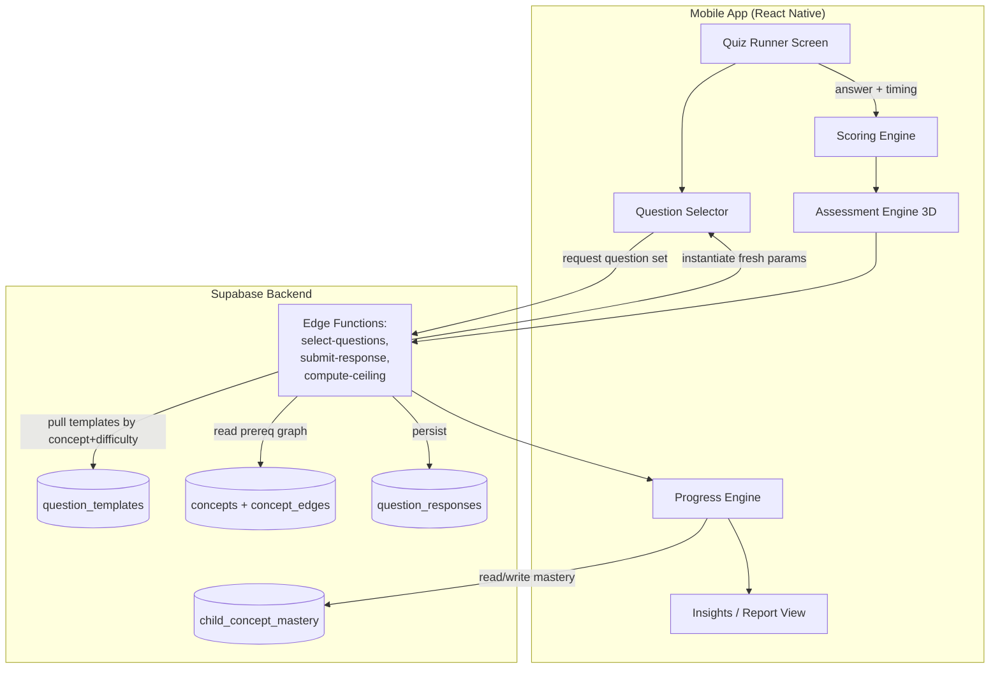
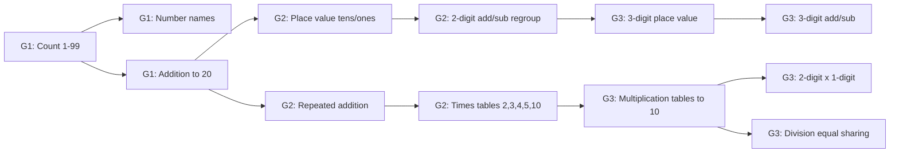

# Design Document: Adaptive Assessment Engine

## Overview

The Adaptive Assessment Engine is the core intellectual property of the V-SPED learning app. It turns every module quiz into a continuous, truly-adaptive diagnostic that maps a child's real competency against a cross-grade concept chain — not a static questionnaire.

Three cooperating engines power it:

1. **Scoring Engine** — records every answer (correct/wrong), maintains per-topic accuracy, streaks, and running scores.
2. **Assessment Engine (3D)** — evaluates each answer along three axes: **difficulty** of the question, **time taken** to answer, and **understanding** (genuine comprehension vs. random guessing).
3. **Progress Engine** — fuses Scoring + Assessment data against a **concept dependency graph** spanning Grades 1–3, backward-traces failures to locate the exact broken foundation, computes the child's *ceiling*, and produces strengths/weaknesses/suggestions.

The question bank is **not a static dump**. Every question is a **parameterised template** that generates a fresh instance on each attempt (different numbers, names, contexts), so a child can never memorise an answer from a prior sitting. Difficulty is multi-tiered and explicitly modelled.

Scope for v1: **Grades 1, 2, 3** (grouped — same developmental stage), subjects **Math, English, EVS, Hindi**, grounded in the **NIPUN Bharat** foundational-learning framework and NCERT materials. All questions are **MCQ**. The engine runs **app-native** (not inside the HTML module), because it must pull diagnostic questions from any grade in real time and remain protected IP.

## Design Rationale & Key Decisions

| Decision | Choice | Why |
|----------|--------|-----|
| Question format (v1) | MCQ only | Objective, auto-gradable, no NLP needed; adaptivity comes from selection + templating, not format |
| Question storage | Server-side (Supabase PostgreSQL) | Central control, no client tampering, protects IP, enables cross-grade selection |
| Anti-memorisation | Parameterised templates instantiated per attempt | Prevents false-positive data from repeated exact questions |
| Quiz location | App-native (React Native), NOT in module HTML | Engine must inject cross-grade diagnostics live; keeps core IP off the sandboxed content layer |
| Assessment cadence | Continuous — every module quiz feeds engines; ceiling recomputed each chapter | Accurate learning-velocity tracking; not gated behind parent action |
| Concept model | Cross-grade prerequisite DAG at concept level | Enables butterfly-effect backward tracing to true root cause |
| Framework grounding | NIPUN Bharat competencies + NCERT | National standard; authoritative, publicly adaptable (NCERT with attribution) |

## Architecture



### Why Edge Functions own selection & scoring

The three engines have client-side representations for responsiveness (immediate feedback, timers), but the **authoritative** selection, response validation, and mastery computation happen in **Edge Functions**. This prevents:
- Clients seeing correct answers before answering (templates are instantiated server-side; only options are sent).
- Tampering with scores or mastery.
- Leaking the concept graph / IP to the client bundle.

## Components and Interfaces

### Component 1: Quiz Runner (Screen)
**Purpose:** Presents one MCQ at a time, times each answer, sends responses to the engines, shows feedback + worked solution.
**Interface:**
```typescript
interface QuizRunnerProps { childId: string; moduleId: string; concepts: string[]; }
interface QuizRunnerState { current: GeneratedQuestion | null; startedAt: number; answered: number; }
```
**Responsibilities:** request questions from `select-questions`, measure `time_taken_ms`, submit via `submit-response`, render explanation, advance.

### Component 2: Question Selector (Edge Function `select-questions`)
**Purpose:** Server-authoritative adaptive selection + template instantiation.
**Interface:** `selectNextQuestion(childId, activeConcepts, masteryMap, history) → GeneratedQuestion`
**Responsibilities:** run selection algorithm, decide diagnostic vs. progression, instantiate fresh params, persist instance secret, return client-safe payload.

### Component 3: Scoring Engine
**Purpose:** Deterministic bookkeeping of correct/wrong, streaks, per-topic accuracy.
**Interface:** `record()`, `accuracy()`, `currentStreak()`, `sessionScore()` (see Engine 1 below).

### Component 4: Assessment Engine (3D)
**Purpose:** Score answer *quality* along difficulty × time × understanding.
**Interface:** `understandingSignal(response, recentContext) → number` (see Engine 2 below).

### Component 5: Progress Engine
**Purpose:** Fuse signals into cross-grade mastery, find ceiling, backward-trace failures, emit insights.
**Interface:** `updateMastery()`, `findBrokenFoundation()`, `computeCeiling()`, `getInsights()` (see Engine 3 below).

### Component 6: Insights / Report View (Screen)
**Purpose:** Parent-facing read-only view of ceiling, strengths, weaknesses, suggestions.
**Interface:** `interface InsightsProps { childId: string; }` — renders `ProgressInsights`.

## The Concept Chain (Cross-Grade DAG)

The heart of the system. Concepts are nodes; prerequisite relationships are directed edges. A child failing a Grade-3 concept triggers traversal *backwards* along edges to find the earliest unmastered prerequisite.



Example butterfly trace: a Grade-3 child fails **Division (C11)**. The Progress Engine walks back C11 → C9 → C7 → C6 → C3. It serves a C6 (repeated addition, Grade 2) diagnostic. If the child fails that too, it drops to C3 (addition, Grade 1). The earliest node the child *passes* while its dependent *fails* is the **broken foundation** — the precise remediation target.

## Data Models

### Concept

```typescript
interface Concept {
  id: string;                    // uuid
  code: string;                  // stable slug e.g. 'math.g2.place_value'
  subject_id: string;            // FK subjects
  grade: number;                 // 1-3 (nominal "home" grade)
  nipun_component: string;       // 'numbers_operations' | 'pre_number' | 'measurement' | ...
  nipun_lakshya_ref: string | null; // NIPUN target reference, for provenance
  title: string;
  description: string;
  created_at: string;
}
```

### ConceptEdge (prerequisite relationship)

```typescript
interface ConceptEdge {
  id: string;
  prerequisite_id: string;       // FK concepts — must be mastered first
  dependent_id: string;          // FK concepts — builds on prerequisite
  strength: number;              // 0.0-1.0 — how critical the prereq is (weights the trace)
  // INVARIANT: graph is acyclic (enforced at insert)
}
```

### QuestionTemplate

```typescript
interface QuestionTemplate {
  id: string;
  concept_id: string;            // FK concepts
  difficulty: number;            // 1-5 tier within the concept
  format: 'mcq';                 // v1: MCQ only
  // Template with placeholders, e.g. "What is {a} + {b}?"
  stem_template: string;
  // Parameter generation rules (server-evaluated)
  param_spec: {
    // e.g. { "a": {min:1,max:9}, "b": {min:1,max:9} }
    [key: string]: { min: number; max: number; step?: number } | { pool: string[] };
  };
  // How to compute the correct answer from params (safe expression / rule id)
  answer_rule: string;           // e.g. "a + b"  (evaluated in a sandboxed evaluator)
  // How distractors (wrong options) are generated
  distractor_rules: string[];    // e.g. ["correct+1","correct-1","a*b"]
  // Difficulty signals for the 3D engine
  expected_seconds: number;      // baseline time a competent child takes
  explanation_template: string;  // step-by-step worked solution with same placeholders
  status: 'draft' | 'published';
  source_attribution: string;    // NCERT ref or 'original'
  created_at: string;
}
```

### GeneratedQuestion (ephemeral — not stored pre-answer)

```typescript
// Produced server-side per attempt; only safe fields sent to client
interface GeneratedQuestion {
  instance_id: string;           // links response back to template + params
  template_id: string;
  concept_id: string;
  difficulty: number;
  stem: string;                  // "What is 4 + 7?"
  options: string[];             // shuffled; correct answer index kept server-side
  expected_seconds: number;
  // correct_index and params are NOT sent to client — held server-side keyed by instance_id
}
```

### QuestionResponse

```typescript
interface QuestionResponse {
  id: string;
  child_id: string;              // FK children
  module_id: string | null;      // FK modules (null for pure diagnostic runs)
  concept_id: string;
  template_id: string;
  instance_id: string;
  difficulty: number;
  selected_index: number;
  is_correct: boolean;
  time_taken_ms: number;
  // 3D assessment outputs
  understanding_signal: number;  // 0.0-1.0 (see Assessment Engine)
  was_diagnostic: boolean;       // true if served as a backward-trace probe
  answered_at: string;
}
```

### ChildConceptMastery

```typescript
interface ChildConceptMastery {
  id: string;
  child_id: string;
  concept_id: string;
  mastery: number;               // 0.0-1.0 rolling estimate
  confidence: number;            // 0.0-1.0 — how sure we are (sample size based)
  avg_time_ratio: number;        // observed_time / expected_time
  status: 'not_assessed' | 'struggling' | 'developing' | 'proficient' | 'mastered';
  is_ceiling: boolean;           // true if this is the child's current frontier
  last_assessed_at: string;
  // UNIQUE(child_id, concept_id)
}
```

## Engine 1: Scoring Engine

**Purpose:** The bookkeeper. Deterministic, simplest of the three.

```typescript
interface ScoringEngine {
  // Called on each answered question
  record(response: QuestionResponse): void;
  // Per-concept accuracy over a rolling window
  accuracy(childId: string, conceptId: string): number;     // 0.0-1.0
  currentStreak(childId: string): number;
  sessionScore(childId: string, moduleId: string): { score: number; max: number };
}
```

**Logic:** pure aggregation. `accuracy = correct / attempted` over the last N responses for that concept (windowed so recent performance dominates). Feeds raw signals to the Assessment Engine.

## Engine 2: Assessment Engine (3D)

**Purpose:** Judge the *quality* of each answer, not just right/wrong. Three dimensions combine into an `understanding_signal ∈ [0,1]`.

### Dimension 1 — Difficulty
Taken from the template's `difficulty` tier (1–5). A correct answer at difficulty 5 is worth far more evidence of mastery than at difficulty 1.

### Dimension 2 — Time taken
Compare `time_taken_ms` against the template's `expected_seconds`:

```
time_ratio = time_taken / expected_time
```
- `time_ratio` very low (e.g. < 0.3) AND wrong → likely random guessing.
- `time_ratio` very low AND correct → strong automaticity (deep mastery).
- `time_ratio` moderate AND correct → solid understanding.
- `time_ratio` very high → hesitation / shaky grasp even if correct.

### Dimension 3 — Understanding (guess detection)
Combines patterns across the current question and recent history:

```typescript
// ALGORITHM: understanding_signal for one response
// PRECONDITION: response has is_correct, time_taken_ms, difficulty
// POSTCONDITION: returns u ∈ [0,1]; low u = likely guessing / no comprehension
function understandingSignal(r: Response, ctx: RecentContext): number {
  const timeRatio = r.time_taken_ms / (r.expected_seconds * 1000);

  // Guess indicators
  const tooFast = timeRatio < 0.3;               // answered faster than readable
  const impossiblyFastForDifficulty = timeRatio < 0.5 && r.difficulty >= 4;
  const randomPattern = ctx.recentSelectedIndices // same option repeatedly / alternating
    && isLowEntropy(ctx.recentSelectedIndices);

  if (r.is_correct) {
    if (tooFast && r.difficulty >= 3) return 0.4;  // suspicious fast-correct on hard item
    if (timeRatio > 3.0) return 0.6;               // correct but very slow = shaky
    return clamp(0.7 + 0.3 * (r.difficulty / 5), 0, 1); // strong, scaled by difficulty
  } else {
    if (tooFast || impossiblyFastForDifficulty) return 0.05; // near-certain guess
    if (randomPattern) return 0.1;
    return 0.35; // genuine attempt but wrong = partial understanding
  }
}
```

**Output** per response: `understanding_signal`, persisted on the `question_responses` row, consumed by the Progress Engine.

## Engine 3: Progress Engine

**Purpose:** The intelligence layer. Converts a stream of 3D-scored responses into a mastery map over the concept graph, finds the ceiling, backward-traces failures, and emits suggestions.

### Mastery update (Bayesian-style rolling estimate)

```typescript
// ALGORITHM: update concept mastery after a response
// PRECONDITION: response scored by Assessment Engine
// POSTCONDITION: child_concept_mastery updated; status recomputed
function updateMastery(prev: Mastery, r: Response): Mastery {
  // Evidence weight grows with difficulty and understanding quality
  const weight = (r.difficulty / 5) * r.understanding_signal;
  const target = r.is_correct ? 1.0 : 0.0;

  // Exponential moving average toward evidence, learning rate scaled by weight
  const lr = 0.15 + 0.25 * weight;                 // 0.15–0.40
  const mastery = clamp(prev.mastery + lr * (target - prev.mastery), 0, 1);

  // Confidence grows with sample size (more responses = more certain)
  const confidence = 1 - Math.exp(-prev.sampleCount / 6);

  return { mastery, confidence, status: classify(mastery, confidence) };
}

function classify(m: number, c: number): MasteryStatus {
  if (c < 0.3) return 'not_assessed';       // too little data
  if (m < 0.35) return 'struggling';
  if (m < 0.6)  return 'developing';
  if (m < 0.85) return 'proficient';
  return 'mastered';
}
```

### Backward-trace (butterfly root-cause finder)

```typescript
// ALGORITHM: locate the broken foundation for a failed concept
// PRECONDITION: child failed concept C (mastery below threshold with confidence)
// POSTCONDITION: returns the earliest prerequisite that is unmastered but whose
//                own prerequisites are mastered — the precise remediation target
function findBrokenFoundation(childId, C, graph, masteryMap): Concept {
  // BFS/DFS backward along prerequisite edges, deepest-first
  const visited = new Set();
  const stack = [C];
  let deepestBroken = C;

  while (stack.length) {
    const node = stack.pop();
    if (visited.has(node.id)) continue;
    visited.add(node.id);

    const prereqs = graph.prerequisitesOf(node.id);      // incoming edges
    for (const p of prereqs) {
      const m = masteryMap.get(p.id);
      if (!m || m.mastery < MASTERY_THRESHOLD) {
        deepestBroken = p;          // a prerequisite is also weak — go deeper
        stack.push(p);
      }
    }
  }
  // deepestBroken = earliest weak concept in the chain
  return deepestBroken;
}
```

When a break is found, the Question Selector serves a **diagnostic probe** (a fresh templated question) at that earlier concept, flagged `was_diagnostic = true`, to confirm the hypothesis before committing to a remediation suggestion.

### Ceiling computation

```typescript
// ALGORITHM: recompute a child's ceiling (called after each chapter)
// The ceiling = the frontier where 'mastered/proficient' concepts meet
// 'struggling/not_assessed' dependents.
function computeCeiling(childId, graph, masteryMap): Concept[] {
  return graph.allConcepts().filter(c => {
    const m = masteryMap.get(c.id);
    const solid = m && m.mastery >= CEILING_MASTERY && m.confidence >= CEILING_CONF;
    if (!solid) return false;
    // ceiling if at least one dependent is NOT yet solid
    return graph.dependentsOf(c.id).some(d => {
      const dm = masteryMap.get(d.id);
      return !dm || dm.mastery < CEILING_MASTERY;
    });
  });
}
```

### Insights output

```typescript
interface ProgressInsights {
  child_id: string;
  ceiling: { concept: Concept; grade: number }[];   // current frontier
  strengths: Concept[];        // mastered, high confidence
  weaknesses: {
    concept: Concept;
    broken_foundation: Concept | null;  // from backward-trace
    suggestion: string;                 // plain-language remediation
  }[];
  learning_velocity: number;   // mastery gained per module over time
  updated_at: string;
}
```

## Adaptive Question Selection

```typescript
// ALGORITHM: choose the next question during a quiz
// PRECONDITION: child is on module M covering concept set {C}
// POSTCONDITION: returns a freshly-instantiated GeneratedQuestion
function selectNextQuestion(childId, activeConcepts, masteryMap, history): GeneratedQuestion {
  // 1. If a recent answer failed at difficulty d, and backward-trace flags a
  //    weak prerequisite, serve a DIAGNOSTIC probe at the prerequisite concept.
  const probe = maybeDiagnostic(childId, history, masteryMap);
  if (probe) return instantiate(probe.template, { diagnostic: true });

  // 2. Otherwise pick the active concept with the most informative next item:
  //    target difficulty ≈ current mastery frontier (not too easy, not too hard).
  const concept = pickMostInformative(activeConcepts, masteryMap);
  const targetDifficulty = masteryToDifficulty(masteryMap.get(concept.id));

  // 3. Choose a template at that difficulty NOT recently seen, instantiate fresh params.
  const template = pickUnseenTemplate(concept, targetDifficulty, history);
  return instantiate(template, { diagnostic: false });
}

// masteryToDifficulty: aim slightly above current mastery (zone of proximal development)
function masteryToDifficulty(m: Mastery): number {
  const base = Math.round(1 + m.mastery * 4);     // 1..5
  return clamp(base + (m.mastery > 0.8 ? 1 : 0), 1, 5);
}
```

### Template instantiation (anti-memorisation)

```typescript
// ALGORITHM: instantiate a template into a fresh question
// PRECONDITION: template.param_spec defines all placeholders in stem_template
// POSTCONDITION: returns question with fresh params; correct answer + params
//                stored server-side keyed by instance_id (NOT sent to client)
function instantiate(t: QuestionTemplate): { client: GeneratedQuestion; secret: Secret } {
  const params = {};
  for (const [key, spec] of Object.entries(t.param_spec)) {
    params[key] = 'pool' in spec
      ? randomChoice(spec.pool)
      : randomInt(spec.min, spec.max, spec.step);
  }
  const stem = fill(t.stem_template, params);
  const correct = safeEval(t.answer_rule, params);          // sandboxed evaluator
  const distractors = t.distractor_rules.map(r => safeEval(r, { ...params, correct }));
  const options = shuffle(dedupeToFour([correct, ...distractors]));
  const correctIndex = options.indexOf(correct);

  const instanceId = uuid();
  return {
    client: { instance_id: instanceId, template_id: t.id, concept_id: t.concept_id,
              difficulty: t.difficulty, stem, options: options.map(String),
              expected_seconds: t.expected_seconds },
    secret: { instanceId, correctIndex, params },           // held server-side
  };
}
```

## Edge Functions (server-authoritative)

| Function | Responsibility |
|----------|----------------|
| `select-questions` | Runs selection algorithm, instantiates templates, stores secrets keyed by instance_id (short TTL), returns client-safe questions |
| `submit-response` | Validates answer against stored secret, computes is_correct + time signals, runs Assessment Engine, persists `question_responses`, updates `child_concept_mastery` |
| `compute-ceiling` | Called after each chapter; recomputes ceiling + insights; writes `child_concept_mastery.is_ceiling` and returns `ProgressInsights` |

**Security:** correct answers never reach the client before submission. Instance secrets live in a short-TTL store (in-table with `expires_at`, or KV) keyed by `instance_id`. RLS ensures a child's responses/mastery are readable only by the owning parent (`children.parent_id = auth.uid()`).

## Database Schema (SQL)

```sql
CREATE TABLE public.concepts (
  id UUID PRIMARY KEY DEFAULT gen_random_uuid(),
  code TEXT UNIQUE NOT NULL,
  subject_id UUID NOT NULL REFERENCES public.subjects(id),
  grade INT NOT NULL CHECK (grade BETWEEN 1 AND 3),
  nipun_component TEXT NOT NULL,
  nipun_lakshya_ref TEXT,
  title TEXT NOT NULL,
  description TEXT,
  created_at TIMESTAMPTZ NOT NULL DEFAULT NOW()
);

CREATE TABLE public.concept_edges (
  id UUID PRIMARY KEY DEFAULT gen_random_uuid(),
  prerequisite_id UUID NOT NULL REFERENCES public.concepts(id),
  dependent_id UUID NOT NULL REFERENCES public.concepts(id),
  strength NUMERIC(3,2) NOT NULL DEFAULT 1.0 CHECK (strength BETWEEN 0 AND 1),
  UNIQUE(prerequisite_id, dependent_id),
  CHECK (prerequisite_id <> dependent_id)
);

CREATE TABLE public.question_templates (
  id UUID PRIMARY KEY DEFAULT gen_random_uuid(),
  concept_id UUID NOT NULL REFERENCES public.concepts(id),
  difficulty INT NOT NULL CHECK (difficulty BETWEEN 1 AND 5),
  format TEXT NOT NULL DEFAULT 'mcq' CHECK (format = 'mcq'),
  stem_template TEXT NOT NULL,
  param_spec JSONB NOT NULL,
  answer_rule TEXT NOT NULL,
  distractor_rules JSONB NOT NULL DEFAULT '[]'::jsonb,
  expected_seconds INT NOT NULL DEFAULT 30,
  explanation_template TEXT,
  status TEXT NOT NULL DEFAULT 'draft' CHECK (status IN ('draft','published')),
  source_attribution TEXT NOT NULL DEFAULT 'original',
  created_at TIMESTAMPTZ NOT NULL DEFAULT NOW()
);

CREATE TABLE public.question_responses (
  id UUID PRIMARY KEY DEFAULT gen_random_uuid(),
  child_id UUID NOT NULL REFERENCES public.children(id) ON DELETE CASCADE,
  module_id UUID REFERENCES public.modules(id),
  concept_id UUID NOT NULL REFERENCES public.concepts(id),
  template_id UUID NOT NULL REFERENCES public.question_templates(id),
  instance_id UUID NOT NULL,
  difficulty INT NOT NULL,
  selected_index INT NOT NULL,
  is_correct BOOLEAN NOT NULL,
  time_taken_ms INT NOT NULL,
  understanding_signal NUMERIC(4,3) NOT NULL,
  was_diagnostic BOOLEAN NOT NULL DEFAULT false,
  answered_at TIMESTAMPTZ NOT NULL DEFAULT NOW()
);

CREATE TABLE public.child_concept_mastery (
  id UUID PRIMARY KEY DEFAULT gen_random_uuid(),
  child_id UUID NOT NULL REFERENCES public.children(id) ON DELETE CASCADE,
  concept_id UUID NOT NULL REFERENCES public.concepts(id),
  mastery NUMERIC(4,3) NOT NULL DEFAULT 0 CHECK (mastery BETWEEN 0 AND 1),
  confidence NUMERIC(4,3) NOT NULL DEFAULT 0 CHECK (confidence BETWEEN 0 AND 1),
  avg_time_ratio NUMERIC(5,2) NOT NULL DEFAULT 1.0,
  sample_count INT NOT NULL DEFAULT 0,
  status TEXT NOT NULL DEFAULT 'not_assessed'
    CHECK (status IN ('not_assessed','struggling','developing','proficient','mastered')),
  is_ceiling BOOLEAN NOT NULL DEFAULT false,
  last_assessed_at TIMESTAMPTZ NOT NULL DEFAULT NOW(),
  UNIQUE(child_id, concept_id)
);

-- Ephemeral instance secrets (correct answer held server-side until submission)
CREATE TABLE public.question_instances (
  instance_id UUID PRIMARY KEY,
  child_id UUID NOT NULL REFERENCES public.children(id) ON DELETE CASCADE,
  template_id UUID NOT NULL REFERENCES public.question_templates(id),
  correct_index INT NOT NULL,
  params JSONB NOT NULL,
  expires_at TIMESTAMPTZ NOT NULL DEFAULT (NOW() + INTERVAL '1 hour')
);

CREATE INDEX idx_concepts_subject_grade ON public.concepts(subject_id, grade);
CREATE INDEX idx_edges_dependent ON public.concept_edges(dependent_id);
CREATE INDEX idx_edges_prereq ON public.concept_edges(prerequisite_id);
CREATE INDEX idx_templates_concept_diff ON public.question_templates(concept_id, difficulty, status);
CREATE INDEX idx_responses_child_concept ON public.question_responses(child_id, concept_id);
CREATE INDEX idx_mastery_child ON public.child_concept_mastery(child_id);

-- RLS
ALTER TABLE public.concepts ENABLE ROW LEVEL SECURITY;
ALTER TABLE public.concept_edges ENABLE ROW LEVEL SECURITY;
ALTER TABLE public.question_templates ENABLE ROW LEVEL SECURITY;
ALTER TABLE public.question_responses ENABLE ROW LEVEL SECURITY;
ALTER TABLE public.child_concept_mastery ENABLE ROW LEVEL SECURITY;
ALTER TABLE public.question_instances ENABLE ROW LEVEL SECURITY;

-- Concepts / edges / templates: readable by authenticated (templates only via Edge Fn ideally)
CREATE POLICY concepts_read ON public.concepts FOR SELECT USING (true);
CREATE POLICY edges_read ON public.concept_edges FOR SELECT USING (true);
-- Templates: NO direct client read (answers/rules are IP). Access only via service role in Edge Fns.
CREATE POLICY templates_no_client ON public.question_templates FOR SELECT USING (false);

-- Responses + mastery: parent reads own children only
CREATE POLICY responses_parent_read ON public.question_responses FOR SELECT USING (
  child_id IN (SELECT id FROM public.children WHERE parent_id = auth.uid())
);
CREATE POLICY mastery_parent_read ON public.child_concept_mastery FOR SELECT USING (
  child_id IN (SELECT id FROM public.children WHERE parent_id = auth.uid())
);
-- Writes to responses/mastery/instances: service role only (Edge Functions)
CREATE POLICY instances_no_client ON public.question_instances FOR SELECT USING (false);
```

## Correctness Properties

### Property 1: No Pre-Answer Leak
For every generated question, the correct option index is never present in the client payload before `submit-response` is called. ∀ question Q sent to client: Q contains no field revealing the correct answer.

### Property 2: Anti-Memorisation
Two attempts of the same template by the same child produce different instantiated params with probability ≥ 1 − 1/|param-space|. Identical (stem, options) sets across consecutive attempts are rejected by the selector.

### Property 3: Graph Acyclicity
`concept_edges` never forms a cycle (enforced at insert). Therefore the backward-trace always terminates.

### Property 4: Mastery Bounds
For all mastery updates the result ∈ [0,1], and confidence is monotonically non-decreasing with sample_count.

### Property 5: Guess Penalisation
A too-fast wrong answer (time_ratio < 0.3) yields understanding_signal ≤ 0.1 and cannot raise mastery.

### Property 6: Backward-Trace Correctness
findBrokenFoundation returns concept B such that mastery(B) < threshold AND all prerequisites of B are ≥ threshold (or B has no prerequisites) — the true earliest break in the chain.

### Property 7: RLS Isolation
A parent reads responses/mastery only for children where parent_id = auth.uid(). Question templates are never client-readable.

### Property 8: Ceiling Validity
Every concept flagged is_ceiling is itself solid (mastery ≥ CEILING_MASTERY) and has ≥ 1 non-solid dependent.

### Property 9: DPDP Compliance
Assessment data is child-linked but parent-owned; no admin bypass exists; no child PII enters any question or is exposed to third parties.

## Error Handling

| Scenario | Response | Recovery |
|----------|----------|----------|
| Instance secret expired before submit | Reject submission with `instance_expired` | Client re-requests question; no score change |
| Malformed answer_rule / distractor_rule | Template fails validation at publish time | Never published; author fixes rule |
| Backward-trace hits missing mastery rows | Treat missing as `not_assessed` (weak) | Serve diagnostic at that concept to gather data |
| Network drop mid-quiz | Client caches responses, retries submit | Idempotent submit keyed by instance_id |
| Not enough templates at target difficulty | Fall back to nearest available difficulty | Log gap for content team to fill |

## Testing Strategy

- **Unit:** understandingSignal across the guess/mastery matrix; masteryToDifficulty bounds; classify thresholds; safeEval sandbox rejects unsafe expressions.
- **Property-based (fast-check):** mastery always ∈ [0,1]; instantiation never leaks correct index client-side; backward-trace terminates on any acyclic graph; two instantiations differ across param space.
- **Integration:** full quiz loop (select → answer → submit → mastery update → ceiling recompute); backward-trace serves correct-grade diagnostic; RLS blocks cross-family reads and all template reads.
- **Content validation:** every published template's answer_rule evaluates to exactly one option; distractors never equal correct; expected_seconds > 0.

## Scope Boundaries (v1)

**In scope:** Grades 1–3; Math, English, EVS, Hindi; MCQ only; three engines; concept DAG; templated question bank; continuous assessment; ceiling + insights; NIPUN-grounded concept taxonomy.

**Out of scope (later):** Non-MCQ formats; handwriting/work capture grading; grades 4–10 concept graph (structure supports extension); parent-configurable assessment; offline assessment; the smartpen hardware sync.

## Dependencies

- No new npm packages (Ponytail Protocol). Uses existing `@supabase/supabase-js`, `zustand`, `expo-router`.
- Edge Functions in Deno/TypeScript, imports pinned to the approved `@2.49.1` Supabase set.
- Reuses existing `children`, `subjects`, `modules` tables from the learning-modules spec.

## Open Content Questions (for the content team, not blocking engine build)

1. Exact NIPUN Lakshya → concept mapping per subject (I have the component structure; the fine-grained per-grade competency list should be validated against the latest NIPUN handbook).
2. Difficulty-tier rubric per subject (how "difficulty 3" differs from "difficulty 4" in wording/steps) — to be defined from NCERT material analysis.
3. Distractor design guidelines per concept (common misconceptions make the best wrong options).
