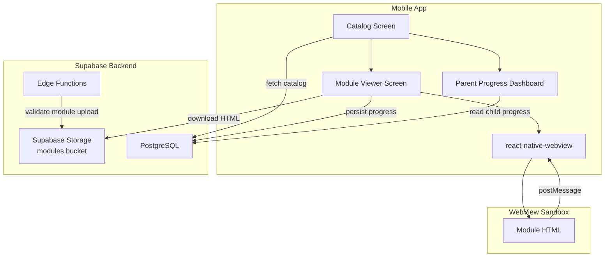
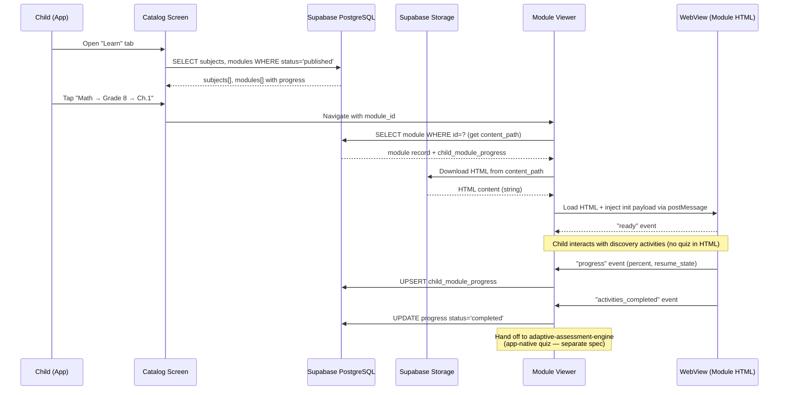
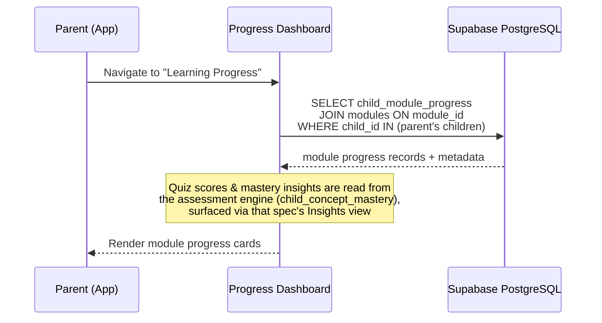

# Design Document: Learning Modules

## Overview

The Learning Modules subsystem adds child-facing interactive educational **content** to V-SPED's consumer acquisition branch. Children browse a catalog of subjects → grades → chapters, open self-contained HTML modules in a sandboxed WebView, complete **interactive discovery activities**, and have their content progress tracked for parent visibility.

> **Scope boundary (important):** This spec covers **content delivery only** — the catalog, the WebView module viewer, progress tracking, and the parent progress dashboard. The **quiz / assessment is NOT part of the module HTML.** Assessment is an app-native subsystem owned by the separate **`adaptive-assessment-engine`** spec (three engines, cross-grade concept graph, server-side templated question bank). When a child finishes a module's activities, the viewer hands off to the assessment engine, which runs the adaptive quiz natively. This keeps the assessment IP off the sandboxed content layer and lets it pull diagnostic questions from any grade in real time.

The architecture decouples content from code: modules are standalone HTML files stored in Supabase Storage, rendered inside `react-native-webview` with a stable `postMessage` bridge contract. This means publishing new educational content never requires an app release. The parent dashboard surfaces per-child module progress; quiz scores and mastery come from the assessment engine. All data is governed by the existing DPDP-compliant RLS model where children are profile rows owned by `parent_id`.

No educator features are included — this is parent + child only. The existing `children` table (id, parent_id, encrypted PII) is reused as-is; new tables in **this** spec are `subjects`, `modules`, and `child_module_progress` — no `quiz_attempts` here (that lives in the assessment engine spec as `question_responses`). Nothing duplicates any identity concept.

## Architecture



## Sequence Diagrams

### Module Browse & Launch Flow



### Parent Progress Dashboard Flow



## Components and Interfaces

### Component 1: Module Catalog (Screen)

**Purpose**: Browse available learning modules by subject → grade → chapter. Display progress state per child, handle prerequisite locking.

**Interface**:
```typescript
// app/dashboard/learn.tsx — new tab in dashboard
interface CatalogProps {
  childId: string; // active child profile
}

// Zustand store slice
interface LearningStore {
  subjects: Subject[];
  modules: Module[];
  progress: Map<string, ChildModuleProgress>;
  activeChildId: string | null;
  fetchCatalog: (childId: string) => Promise<void>;
  getModulesForGrade: (subjectId: string, grade: number) => Module[];
  isModuleUnlocked: (moduleId: string) => boolean;
}
```

**Responsibilities**:
- Fetch and cache subjects + published modules from Supabase
- Display subject cards → grade picker → module list
- Show progress badges (not started / in progress / completed)
- Enforce prerequisite locking (greyed out if prerequisites incomplete)
- Navigate to Module Viewer on tap

### Component 2: Module Viewer (Screen)

**Purpose**: Download and render a module HTML inside a sandboxed WebView. Handle the postMessage bridge lifecycle: send init payload, receive events, persist state.

**Interface**:
```typescript
// app/learn/[moduleId].tsx — deep-link capable route
interface ModuleViewerProps {
  moduleId: string;
  childId: string;
}

interface ModuleViewerState {
  html: string | null;
  isLoading: boolean;
  error: string | null;
  progress: number; // 0–100
  resumeState: Record<string, unknown> | null;
}
```

**Responsibilities**:
- Fetch module record + child's resume_state from DB
- Download HTML from Supabase Storage
- Render in `react-native-webview` with sandbox restrictions
- Send init payload (child display name, accessibility profile, resume state)
- Listen for postMessage events and dispatch to persistence layer
- Handle back navigation with "save progress" confirmation

### Component 3: WebView Bridge (Host-side)

**Purpose**: Thin abstraction layer over `react-native-webview` postMessage. Encodes/decodes the protocol, validates event shapes, dispatches to handlers.

**Interface**:
```typescript
interface BridgeConfig {
  childId: string;
  moduleId: string;
  accessibilityProfile: AccessibilityProfile;
  resumeState: Record<string, unknown> | null;
  onProgress: (percent: number, resumeState: Record<string, unknown>) => void;
  onActivitiesCompleted: () => void; // activities done → viewer hands off to assessment engine
  onReady: () => void;
}

// Injected JS to send init payload after WebView loads
function buildInitInjection(config: BridgeConfig): string;

// Message handler attached to WebView onMessage prop
function handleWebViewMessage(event: WebViewMessageEvent, config: BridgeConfig): void;
```

**Responsibilities**:
- Serialize init payload as JSON and inject via `injectedJavaScript`
- Parse incoming postMessage events (validate shape, reject malformed)
- Route events to appropriate callbacks
- Enforce no-op for unrecognized event types (forward-compatible)

### Component 4: Progress Persistence Layer

**Purpose**: Handle all Supabase writes for child progress and quiz attempts. Debounce frequent progress updates.

**Interface**:
```typescript
interface ProgressService {
  upsertProgress(
    childId: string,
    moduleId: string,
    percent: number,
    resumeState: Record<string, unknown>
  ): Promise<void>;

  markCompleted(childId: string, moduleId: string): Promise<void>;

  getProgress(childId: string, moduleId: string): Promise<ChildModuleProgress | null>;
}
```

**Responsibilities**:
- UPSERT `child_module_progress` with debouncing (max 1 write per 5 seconds)
- Read progress for resume-state hydration
- Handle offline gracefully (queue writes, retry on reconnect)
- Quiz/attempt persistence is NOT handled here — it belongs to the assessment engine (`submit-response` Edge Function)

### Component 5: Parent Progress Dashboard

**Purpose**: Read-only view for parents showing their child's learning progress across all modules.

**Interface**:
```typescript
// Embedded in parent.tsx or new tab
interface ProgressDashboardProps {
  childId: string;
}

interface ProgressSummary {
  totalModules: number;
  completed: number;
  inProgress: number;
  averageQuizScore: number;
  recentActivity: ActivityItem[];
}
```

**Responsibilities**:
- Aggregate module progress across all modules for a child
- Display completion percentage and time spent
- Show recent activity timeline
- Navigate to module detail for per-module breakdown
- (Quiz scores / mastery insights are rendered by the assessment engine's Insights view, not here)

### Component 6: Content Pipeline (Tooling)

**Purpose**: Validate module HTML against the contract, upload to Storage, register in DB.

**Interface**:
```typescript
// tools/validate-module.mjs — CLI tool
interface ValidationResult {
  valid: boolean;
  errors: string[];
  warnings: string[];
}

// Validates: no external URLs, no localStorage, has required events,
// basic a11y (lang attr, alt text), self-contained
function validateModule(htmlPath: string): Promise<ValidationResult>;
```

**Responsibilities**:
- Parse HTML and check for external resource references
- Verify no `localStorage`/`sessionStorage` usage
- Check for required postMessage event emissions (`ready`, `progress`, `activities_completed`)
- Basic accessibility validation (lang, alt, aria)
- Exit non-zero on errors (CI gate)
- NOTE: modules no longer need a quiz section — assessment is app-native

## Data Models

### Subject

```typescript
interface Subject {
  id: string;          // uuid
  slug: string;        // 'math' | 'science' | 'english' | 'social-science'
  name: string;        // Display name: "Mathematics"
  icon: string;        // Emoji or icon identifier
  created_at: string;  // ISO timestamp
}
```

**Validation Rules**:
- `slug` must be unique, lowercase, alphanumeric + hyphens
- `name` required, max 100 chars

### Module

```typescript
interface Module {
  id: string;                  // uuid
  subject_id: string;          // FK → subjects.id
  grade: number;               // 1–10
  unit_no: number;             // Unit within grade
  chapter_no: number;          // Chapter within unit
  slug: string;                // URL-safe identifier, e.g. "squares-and-cubes"
  title: string;               // "Squares and Cubes"
  description: string;         // Brief description for catalog card
  board: 'ncert' | 'cbse' | 'icse' | 'generic';
  status: 'draft' | 'in_review' | 'published';
  content_path: string;        // Supabase Storage path: "modules/math/grade8/ch1.html"
  content_version: number;     // Incremented on content update
  estimated_minutes: number;   // Estimated completion time
  prerequisites: string[];     // Array of module IDs that must be completed first
  accessibility_flags: {
    has_tts: boolean;
    has_visual_aids: boolean;
    reduced_motion_safe: boolean;
    dyslexia_friendly: boolean;
  };
  source_attribution: string | null; // NCERT attribution or "original" for ICSE
  created_at: string;
  updated_at: string;
}
```

**Validation Rules**:
- `grade` must be integer 1–10
- `slug` unique within (subject_id, grade, board)
- `content_path` must point to existing Storage object
- `status` transitions: draft → in_review → published (never skip)
- `board` = 'icse' requires `source_attribution` = 'original' (copyright rule)

### ChildModuleProgress

```typescript
interface ChildModuleProgress {
  id: string;                         // uuid
  child_id: string;                   // FK → children.id
  module_id: string;                  // FK → modules.id
  status: 'not_started' | 'in_progress' | 'completed';
  percent_complete: number;           // 0–100
  resume_state: Record<string, unknown> | null; // Opaque blob for module to resume
  last_activity_at: string;           // ISO timestamp
  completed_at: string | null;        // Set when status='completed'
}
```

**Validation Rules**:
- UNIQUE constraint on (child_id, module_id)
- `percent_complete` 0–100 inclusive
- `completed_at` must be set when status = 'completed'
- `child_id` FK enforces parent ownership via existing RLS on children table

> **Quiz/attempt data moved out.** The former `QuizAttempt` model now lives in the `adaptive-assessment-engine` spec as `question_responses` + `child_concept_mastery`. This spec no longer owns any quiz table.

### AccessibilityProfile (per-child, stored in children table or separate column)

```typescript
interface AccessibilityProfile {
  font_scale: number;        // 1.0 = default, max 2.0
  high_contrast: boolean;
  reduced_motion: boolean;
  tts_enabled: boolean;
  dyslexia_friendly: boolean;
  low_stimulation: boolean;
}
```

## Algorithmic Pseudocode

### Module Loading Algorithm

```typescript
// ALGORITHM: Load and render a module in the WebView
async function loadModule(moduleId: string, childId: string): Promise<void> {
  // PRECONDITION: moduleId exists in modules table with status='published'
  // PRECONDITION: childId belongs to authenticated parent (RLS enforced)
  // POSTCONDITION: WebView displays module HTML with init payload applied

  // Step 1: Fetch module metadata + existing progress
  const module = await supabase
    .from('modules')
    .select('*')
    .eq('id', moduleId)
    .eq('status', 'published')
    .single();

  const progress = await supabase
    .from('child_module_progress')
    .select('*')
    .eq('child_id', childId)
    .eq('module_id', moduleId)
    .maybeSingle();

  // Step 2: Download HTML from Storage
  const { data: htmlBlob } = await supabase.storage
    .from('modules')
    .download(module.content_path);
  const html = await htmlBlob.text();

  // Step 3: Build init payload
  const accessibilityProfile = await getChildAccessibilityProfile(childId);
  const initPayload = {
    type: 'vsped_init',
    childDisplayName: 'Learner', // Never pass real name into sandbox
    accessibility: accessibilityProfile,
    resumeState: progress?.resume_state ?? null,
    moduleId: moduleId,
  };

  // Step 4: Inject into WebView via injectedJavaScript
  const injection = `
    window.addEventListener('message', function(e) {
      if (e.data && e.data.type === 'vsped_init') {
        window.__VSPED_INIT = e.data;
        window.dispatchEvent(new CustomEvent('vsped:init', { detail: e.data }));
      }
    });
    window.ReactNativeWebView.postMessage(JSON.stringify({ type: 'bridge_ready' }));
  `;

  // Step 5: After WebView loads, post init payload
  // (handled in onLoad callback → webViewRef.postMessage(initPayload))
}
```

### Progress Persistence Algorithm (Debounced)

```typescript
// ALGORITHM: Persist progress with 5-second debounce
// PRECONDITION: childId + moduleId are valid, percent ∈ [0, 100]
// POSTCONDITION: child_module_progress row reflects latest state
// INVARIANT: At most 1 write per 5 seconds per module session

let debounceTimer: NodeJS.Timeout | null = null;
let pendingState: { percent: number; resumeState: Record<string, unknown> } | null = null;

function handleProgressEvent(
  childId: string,
  moduleId: string,
  percent: number,
  resumeState: Record<string, unknown>
): void {
  pendingState = { percent, resumeState };

  if (debounceTimer) return; // Already scheduled

  debounceTimer = setTimeout(async () => {
    if (!pendingState) return;

    await supabase
      .from('child_module_progress')
      .upsert({
        child_id: childId,
        module_id: moduleId,
        status: pendingState.percent >= 100 ? 'completed' : 'in_progress',
        percent_complete: pendingState.percent,
        resume_state: pendingState.resumeState,
        last_activity_at: new Date().toISOString(),
        completed_at: pendingState.percent >= 100 ? new Date().toISOString() : null,
      }, { onConflict: 'child_id,module_id' });

    pendingState = null;
    debounceTimer = null;
  }, 5000);
}
```

### Prerequisite Unlock Algorithm

```typescript
// ALGORITHM: Determine if a module is unlocked for a child
// PRECONDITION: module.prerequisites is an array of module IDs (may be empty)
// POSTCONDITION: returns true iff all prerequisites have status='completed'

function isModuleUnlocked(
  moduleId: string,
  modules: Module[],
  progressMap: Map<string, ChildModuleProgress>
): boolean {
  const module = modules.find(m => m.id === moduleId);
  if (!module) return false;

  // No prerequisites = always unlocked
  if (!module.prerequisites || module.prerequisites.length === 0) return true;

  // All prerequisites must be completed
  return module.prerequisites.every(prereqId => {
    const progress = progressMap.get(prereqId);
    return progress?.status === 'completed';
  });
}
```

## Key Functions with Formal Specifications

### Function: handleWebViewMessage()

```typescript
function handleWebViewMessage(
  event: { nativeEvent: { data: string } },
  config: BridgeConfig
): void
```

**Preconditions:**
- `event.nativeEvent.data` is a valid JSON string
- `config` has all required callback functions defined
- WebView has previously emitted 'bridge_ready'

**Postconditions:**
- If event type is recognized, corresponding callback is invoked exactly once
- If event type is unrecognized, no side effects occur (forward-compatible)
- No exceptions thrown to WebView (errors logged internally)
- Progress callbacks receive validated numeric percentages (clamped 0–100)

**Implementation:**
```typescript
function handleWebViewMessage(
  event: { nativeEvent: { data: string } },
  config: BridgeConfig
): void {
  let parsed: unknown;
  try {
    parsed = JSON.parse(event.nativeEvent.data);
  } catch {
    return; // Malformed JSON — ignore silently
  }

  if (!parsed || typeof parsed !== 'object' || !('type' in parsed)) return;

  const msg = parsed as { type: string; [key: string]: unknown };

  switch (msg.type) {
    case 'ready':
      config.onReady();
      break;
    case 'progress':
      const percent = Math.max(0, Math.min(100, Number(msg.percent) || 0));
      const resumeState = (msg.resume_state as Record<string, unknown>) ?? {};
      config.onProgress(percent, resumeState);
      break;
    case 'activities_completed':
      // Discovery activities done — viewer marks progress complete and
      // hands off to the adaptive-assessment-engine (app-native quiz)
      config.onActivitiesCompleted();
      break;
    default:
      // Unknown event type — no-op for forward compatibility
      break;
  }
}
```

### Function: buildInitInjection()

```typescript
function buildInitInjection(config: BridgeConfig): string
```

**Preconditions:**
- `config.accessibilityProfile` is a valid AccessibilityProfile object
- `config.resumeState` is JSON-serializable (or null)

**Postconditions:**
- Returns a JavaScript string safe for `injectedJavaScript` prop
- The script sets up a message listener and posts 'bridge_ready' to host
- No external network calls in the injected script
- Init payload is delivered to module via CustomEvent after host posts it

### Function: fetchCatalog()

```typescript
async function fetchCatalog(childId: string): Promise<{
  subjects: Subject[];
  modules: Module[];
  progress: ChildModuleProgress[];
}>
```

**Preconditions:**
- `childId` belongs to the authenticated user's children (RLS enforces)
- Network connectivity available

**Postconditions:**
- Returns only `status='published'` modules
- Progress array contains entries only for this child
- Subjects are ordered by display priority
- Modules are ordered by (grade, unit_no, chapter_no)

## Example Usage

```typescript
// Example 1: Opening a module from the catalog
import { useRouter } from 'expo-router';
import { useLearningStore } from '../store/learningStore';

function ModuleCard({ module }: { module: Module }) {
  const router = useRouter();
  const isUnlocked = useLearningStore(s => s.isModuleUnlocked(module.id));
  const progress = useLearningStore(s => s.progress.get(module.id));

  return (
    <Pressable
      disabled={!isUnlocked}
      onPress={() => router.push(`/learn/${module.id}`)}
      style={[styles.card, !isUnlocked && styles.locked]}
    >
      <Text style={styles.title}>{module.title}</Text>
      <Text style={styles.meta}>{module.estimated_minutes} min</Text>
      {progress && <ProgressBadge status={progress.status} percent={progress.percent_complete} />}
    </Pressable>
  );
}

// Example 2: Module Viewer with WebView bridge
import { WebView } from 'react-native-webview';
import { useModuleViewer } from '../hooks/useModuleViewer';

function ModuleViewerScreen() {
  const { moduleId } = useLocalSearchParams<{ moduleId: string }>();
  const { html, injection, handleMessage, isLoading } = useModuleViewer(moduleId);

  if (isLoading) return <LoadingSpinner />;

  return (
    <WebView
      source={{ html }}
      injectedJavaScript={injection}
      onMessage={handleMessage}
      javaScriptEnabled={true}
      domStorageEnabled={false}    // Block localStorage
      allowFileAccess={false}
      originWhitelist={['*']}
      style={{ flex: 1 }}
    />
  );
}

// Example 3: Parent progress dashboard query
const { data: progressData } = await supabase
  .from('child_module_progress')
  .select(`
    *,
    module:modules(title, subject_id, grade, estimated_minutes)
  `)
  .eq('child_id', activeChildId)
  .order('last_activity_at', { ascending: false });
```

## PostMessage Bridge Protocol

### Host → Module (Init Payload)

```typescript
// Sent by host after WebView emits 'bridge_ready'
interface InitPayload {
  type: 'vsped_init';
  childDisplayName: string;       // Generic label, never real name in sandbox
  accessibility: AccessibilityProfile;
  resumeState: Record<string, unknown> | null;
  moduleId: string;
}
```

### Module → Host (Events)

```typescript
// All events sent via window.ReactNativeWebView.postMessage(JSON.stringify(event))

type ModuleEvent =
  | { type: 'ready' }
  | { type: 'progress'; percent: number; resume_state: Record<string, unknown> }
  | { type: 'activity_completed'; activity_id: string }
  | { type: 'activities_completed' }   // all discovery activities done → hand off to assessment engine
  | { type: 'a11y_change'; profile: Partial<AccessibilityProfile> };
```

> Note: `quiz_started` / `quiz_result` events are removed. The module HTML contains **no quiz** — it emits `activities_completed`, and the app launches the native adaptive quiz from the `adaptive-assessment-engine` spec.

### Security Constraints

- WebView `domStorageEnabled={false}` — no localStorage/sessionStorage
- WebView `allowFileAccess={false}` — no local file access
- Module HTML must be self-contained (no external network calls)
- No cookies, no IndexedDB access from module context
- All persistence flows through postMessage → host → Supabase only

## Correctness Properties

### Property 1: Progress Monotonicity
For any child+module pair, `percent_complete` in the persisted record is monotonically non-decreasing within a session (progress events never reduce stored percentage unless explicitly reset).

### Property 2: Prerequisite Enforcement
A module with prerequisites is accessible if and only if ALL prerequisite modules have `status='completed'` for that child. ∀ module M with prerequisites P₁..Pₙ: `isUnlocked(M) ⟺ ∀i ∈ [1,n]: progress(Pᵢ).status = 'completed'`

### Property 3: RLS Isolation
A parent can read progress ONLY for children where `children.parent_id = auth.uid()`. No cross-family data leakage. ∀ query Q by user U: results ⊆ { records WHERE child.parent_id = U.id }

### Property 4: Bridge Event Integrity
Every bridge event is JSON-validated before dispatch. Malformed or unrecognized events are dropped (no-op), never persisted, and never throw. Assessment/quiz events are out of scope here (owned by the assessment engine).

### Property 5: Module Sandboxing
The WebView rendering a module has no access to: app state, localStorage, sessionStorage, cookies, file system, or external network. All module state persists exclusively via postMessage.

### Property 6: Content Self-Containment
Every published module (`status='published'`) passes `validate-module.mjs` — no external URLs, no storage APIs, required events present (`ready`, `progress`, `activities_completed`). No quiz section required (assessment is app-native).

### Property 7: Resume Consistency
If a child exits a module at progress P% with resume_state S, re-opening that module delivers S in the init payload, allowing the module to restore position.

### Property 8: Assessment Hand-off
When a module emits `activities_completed`, the viewer marks `child_module_progress.status='completed'` and launches the app-native assessment engine for that module's concepts. The module HTML itself never scores or persists any quiz data.

## Error Handling

### Error Scenario 1: Module HTML Download Failure

**Condition**: Supabase Storage returns 404 or network timeout when downloading module HTML
**Response**: Show friendly error screen with retry button. Do not crash the app.
**Recovery**: Retry up to 3 times with exponential backoff (1s, 3s, 9s). If all fail, navigate back to catalog with toast notification.

### Error Scenario 2: Malformed PostMessage from Module

**Condition**: WebView sends a message that fails JSON.parse() or lacks a `type` field
**Response**: Silently ignore the message. Log to console in development builds.
**Recovery**: No recovery needed — the module continues operating. Host remains in last known good state.

### Error Scenario 3: Progress Write Failure

**Condition**: Supabase UPSERT for child_module_progress fails (network, RLS violation)
**Response**: Queue the write in local memory. Show subtle "saving..." indicator.
**Recovery**: Retry on next successful DB operation or on app foreground. If the session ends without successful save, resume_state from last successful write is used on next open.

### Error Scenario 4: Child Switches Mid-Module

**Condition**: Parent switches active child profile while a module is open
**Response**: Immediately save current progress for the previous child, unload WebView.
**Recovery**: Re-initialize module viewer with new child's progress/resume_state.

### Error Scenario 5: Module Violates Sandbox (CSP)

**Condition**: Module HTML attempts external network request or localStorage access
**Response**: WebView blocks the operation natively (`domStorageEnabled={false}`, no network for loaded HTML). Module may error internally but cannot exfiltrate data.
**Recovery**: No host-side recovery needed. If module reports error via postMessage, display "module error" and offer retry.

## Testing Strategy

### Unit Testing Approach

- Test `handleWebViewMessage` with valid/invalid/malformed JSON inputs
- Test `isModuleUnlocked` with various prerequisite graphs (empty, single, chain, diamond)
- Test `buildInitInjection` output is valid JavaScript
- Test progress debounce logic (multiple rapid calls → single write)
- Test `validateModule` against known-good and known-bad HTML files

### Property-Based Testing Approach

**Property Test Library**: fast-check (TypeScript)

- **Bridge Message Parsing**: For any random JSON string, `handleWebViewMessage` never throws and either invokes exactly one callback or no-ops.
- **Progress Clamping**: For any numeric input to progress handler, persisted percent is always in [0, 100].
- **Prerequisite Graph Acyclicity**: For any valid module set, prerequisite references never form cycles (enforced at insert time).
- **Activities Completion Idempotency**: Repeated `activities_completed` events result in a single completed state (no duplicate hand-offs).

### Integration Testing Approach

- Full flow: catalog fetch → module download → WebView loads → events fire → progress persisted
- RLS enforcement: attempt cross-family progress read → expect empty result
- Resume flow: write progress with resume_state → reload → verify init payload contains saved state
- Prerequisite locking: complete prerequisite → verify dependent module unlocks
- Validator: run `validate-module.mjs` on seeded reference module → expect pass

## Performance Considerations

- **Module HTML size**: Self-contained modules are ~100–500KB. Download once per session, cache in memory. No need for persistent file cache (re-download is fast on 4G+).
- **Catalog queries**: Single query with JOIN for subjects + modules + progress. Index on (subject_id, grade, status) for fast filtering.
- **Progress debouncing**: 5-second debounce prevents write storms from rapid module interactions. Worst case: 12 writes/minute per active session.
- **WebView rendering**: Single WebView instance per module. Unmount completely on navigation away (no background WebViews consuming memory).
- **Offline consideration**: Modules require network to download. Progress writes are queued locally if offline. No full offline mode in Phase 1.

## Security Considerations

- **No child PII in sandbox**: The init payload sends a generic display name ("Learner"), never the child's real encrypted name. The module cannot identify the child.
- **RLS on all new tables**: `child_module_progress` has RLS policies that restrict reads to `parent_id = auth.uid()` (via JOIN on children table).
- **No service-role key on client**: All Supabase operations use the anon key + user JWT. Service role is only in Edge Functions.
- **Module content validation**: `validate-module.mjs` gates CI — no module can be published if it references external URLs or uses forbidden APIs.
- **DPDP compliance**: Progress data (non-PII but child-linked) follows the same consent model — parent owns all visibility. No admin bypass exists for progress records.
- **Content-Security-Policy**: WebView loaded HTML has no access to parent frame's origin. `react-native-webview` sandboxing isolates the module execution context.

## Dependencies

- `react-native-webview` — included in React Native core via Expo SDK 54 (no additional install needed per Ponytail Protocol)
- `@supabase/supabase-js` — already in package.json (^2.110.1)
- `zustand` — already in package.json (^5.0.0) for state management
- `expo-router` — already in package.json (~6.0.24) for navigation
- `expo-secure-store` — already in package.json for auth token storage
- No new third-party packages required

## File Structure

```
mobile/
├── app/
│   ├── dashboard/
│   │   ├── learn.tsx              # New tab: module catalog
│   │   └── _layout.tsx            # Updated: add "Learn" tab
│   └── learn/
│       └── [moduleId].tsx         # Module viewer screen
├── components/
│   ├── ModuleCard.tsx             # Catalog module card
│   ├── ProgressBadge.tsx          # Status badge component
│   └── ParentLearningProgress.tsx # Parent progress dashboard
├── store/
│   └── learningStore.ts           # Zustand store for learning state
├── lib/
│   ├── bridge.ts                  # WebView postMessage bridge
│   └── progressService.ts         # Supabase progress persistence
└── hooks/
    └── useModuleViewer.ts         # Hook composing bridge + persistence
                                   # On 'activities_completed' → navigates to
                                   # the assessment engine's quiz runner (separate spec)

supabase/
├── migrations/
│   └── 2026XXXX_learning_modules.sql  # subjects, modules, child_module_progress + RLS
│                                      # (assessment tables are in the assessment-engine spec)
└── storage/
    └── modules/                   # Bucket for module HTML files
        └── math/grade3/ch1.html   # Seeded reference module (v1 focus: grades 1-3)

tools/
└── validate-module.mjs            # Module HTML validator (CI gate)
```

## Database Schema (SQL)

```sql
-- subjects: lookup table for subject taxonomy
CREATE TABLE public.subjects (
  id UUID PRIMARY KEY DEFAULT gen_random_uuid(),
  slug TEXT UNIQUE NOT NULL CHECK (slug ~ '^[a-z0-9-]+$'),
  name TEXT NOT NULL,
  icon TEXT DEFAULT '📚',
  display_order INT DEFAULT 0,
  created_at TIMESTAMPTZ NOT NULL DEFAULT NOW()
);

-- modules: content registry
CREATE TABLE public.modules (
  id UUID PRIMARY KEY DEFAULT gen_random_uuid(),
  subject_id UUID NOT NULL REFERENCES public.subjects(id),
  grade INT NOT NULL CHECK (grade BETWEEN 1 AND 10),
  unit_no INT NOT NULL DEFAULT 1,
  chapter_no INT NOT NULL DEFAULT 1,
  slug TEXT NOT NULL,
  title TEXT NOT NULL,
  description TEXT,
  board TEXT NOT NULL DEFAULT 'ncert' CHECK (board IN ('ncert','cbse','icse','generic')),
  status TEXT NOT NULL DEFAULT 'draft' CHECK (status IN ('draft','in_review','published')),
  content_path TEXT NOT NULL,
  content_version INT NOT NULL DEFAULT 1,
  estimated_minutes INT DEFAULT 30,
  prerequisites JSONB DEFAULT '[]'::jsonb,
  accessibility_flags JSONB DEFAULT '{}'::jsonb,
  source_attribution TEXT,
  created_at TIMESTAMPTZ NOT NULL DEFAULT NOW(),
  updated_at TIMESTAMPTZ NOT NULL DEFAULT NOW(),
  UNIQUE(subject_id, grade, slug, board)
);

-- child_module_progress: per-child per-module state
CREATE TABLE public.child_module_progress (
  id UUID PRIMARY KEY DEFAULT gen_random_uuid(),
  child_id UUID NOT NULL REFERENCES public.children(id) ON DELETE CASCADE,
  module_id UUID NOT NULL REFERENCES public.modules(id),
  status TEXT NOT NULL DEFAULT 'not_started' CHECK (status IN ('not_started','in_progress','completed')),
  percent_complete INT NOT NULL DEFAULT 0 CHECK (percent_complete BETWEEN 0 AND 100),
  resume_state JSONB,
  last_activity_at TIMESTAMPTZ NOT NULL DEFAULT NOW(),
  completed_at TIMESTAMPTZ,
  UNIQUE(child_id, module_id)
);

-- NOTE: quiz/assessment tables (question_templates, question_responses,
-- child_concept_mastery, concepts, concept_edges, question_instances) are
-- defined in the SEPARATE `adaptive-assessment-engine` spec, not here.

-- Indexes
CREATE INDEX idx_modules_catalog ON public.modules(subject_id, grade, status);
CREATE INDEX idx_progress_child ON public.child_module_progress(child_id);
CREATE INDEX idx_progress_module ON public.child_module_progress(module_id);

-- RLS Policies
ALTER TABLE public.subjects ENABLE ROW LEVEL SECURITY;
ALTER TABLE public.modules ENABLE ROW LEVEL SECURITY;
ALTER TABLE public.child_module_progress ENABLE ROW LEVEL SECURITY;

-- Subjects: anyone authenticated can read
CREATE POLICY subjects_read ON public.subjects FOR SELECT USING (true);

-- Modules: anyone authenticated can read published modules
CREATE POLICY modules_read_published ON public.modules
  FOR SELECT USING (status = 'published');

-- Progress: parent can read/write for own children only
CREATE POLICY progress_parent_select ON public.child_module_progress
  FOR SELECT USING (
    child_id IN (SELECT id FROM public.children WHERE parent_id = auth.uid())
  );

CREATE POLICY progress_parent_insert ON public.child_module_progress
  FOR INSERT WITH CHECK (
    child_id IN (SELECT id FROM public.children WHERE parent_id = auth.uid())
  );

CREATE POLICY progress_parent_update ON public.child_module_progress
  FOR UPDATE USING (
    child_id IN (SELECT id FROM public.children WHERE parent_id = auth.uid())
  );
```
