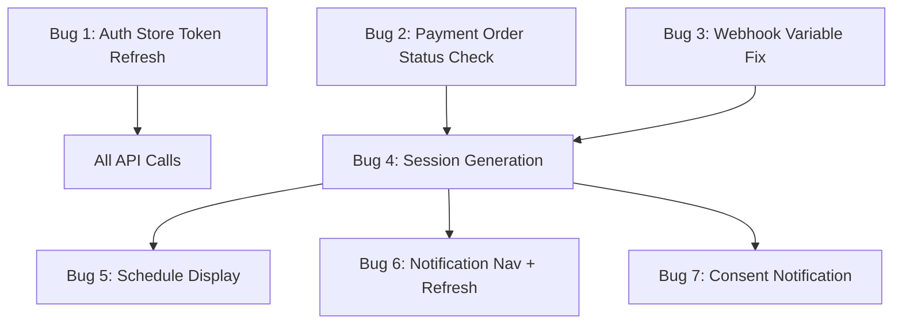
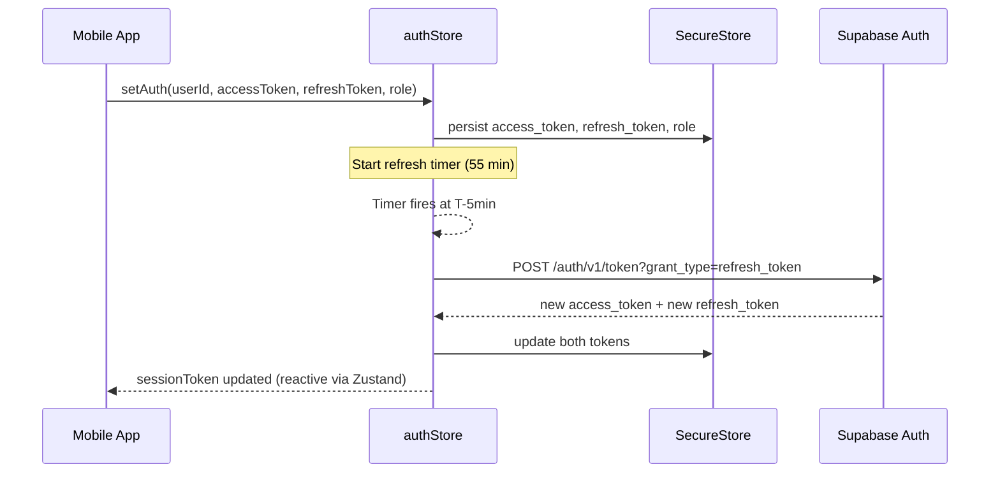
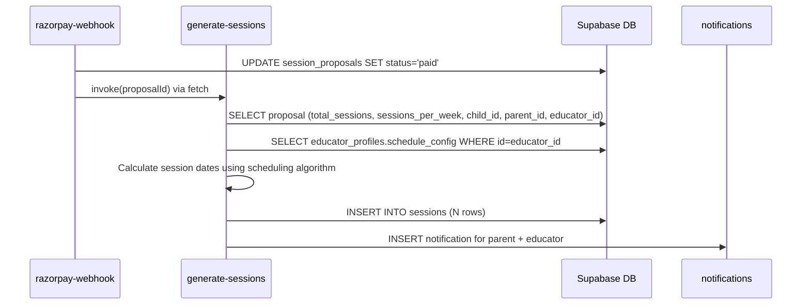

# Design Document: Phase 5 Critical Bugs

## Overview

This document specifies the technical implementation approach for fixing 7 critical bugs in the V-SPED 1.0 platform discovered during end-to-end testing. These bugs block the parent-educator booking lifecycle from completing. Fixes span the Zustand auth store, Supabase Edge Functions (Deno runtime), and React Native UI components. The bugs form a dependency chain: token refresh (1) ensures sessions survive, payment status fix (2) unblocks checkout, webhook variable fix (3) enables payment capture, session generation (4) creates bookable records, and UI fixes (5-7) surface the data to users.

## Architecture



### Dependency Chain

1. **Independent fixes** (can be parallel): Bugs 1, 2, 3
2. **Depends on Bug 3**: Bug 4 (webhook must correctly mark `paid` before generation triggers)
3. **Depends on Bug 4**: Bugs 5, 6, 7 (UI improvements that surface generated session data)

### Deployment Order

1. Deploy Bug 3 fix (webhook) — zero-risk, fixes a runtime crash
2. Deploy Bug 2 fix (payment order) — one-line change, unblocks `parent_accepted` payments
3. Deploy Bug 4 (session generation) — new function, depends on Bug 3
4. Ship mobile update with Bugs 1, 5, 6, 7 bundled together

No database migrations are needed — the `sessions` table already exists with the required columns.

---

## Bug 1: Token Refresh and Session Persistence

### Problem Analysis

The `verify-otp` edge function already returns `refresh_token` in its response, but `authStore.ts` only persists `userId`, `sessionToken` (access token), and `role`. The refresh token is discarded. Supabase access tokens expire after 1 hour, causing silent auth failures.

### Data Flow



### File Changes

**File:** `mobile/store/authStore.ts`

#### Interface Changes

```typescript
interface AuthState {
  userId: string | null;
  sessionToken: string | null;
  refreshToken: string | null;  // NEW
  role: string | null;
  children: Child[];
  isLoading: boolean;
  isRefreshing: boolean;  // NEW — guards concurrent refresh attempts

  // Actions
  setAuth: (userId: string, sessionToken: string, refreshToken: string, role?: string) => Promise<void>;
  loadFromSecureStore: () => Promise<void>;
  refreshSession: () => Promise<boolean>;  // NEW
  fetchChildren: () => Promise<void>;
  logout: () => Promise<void>;
}
```

#### New `refreshSession` Action

```typescript
refreshSession: async () => {
  const { refreshToken, isRefreshing } = get();
  if (!refreshToken || isRefreshing) return false;
  
  set({ isRefreshing: true });
  try {
    const supabase = createClient(SUPABASE_URL, SUPABASE_ANON_KEY);
    const { data, error } = await supabase.auth.refreshSession({ refresh_token: refreshToken });
    
    if (error || !data.session) {
      // Unrecoverable — force logout
      await get().logout();
      return false;
    }
    
    const newAccess = data.session.access_token;
    const newRefresh = data.session.refresh_token;
    
    await SecureStore.setItemAsync('session_token', newAccess);
    await SecureStore.setItemAsync('refresh_token', newRefresh);
    set({ sessionToken: newAccess, refreshToken: newRefresh, isRefreshing: false });
    return true;
  } catch {
    set({ isRefreshing: false });
    return false;
  }
}
```

#### Modified `setAuth` (adds refreshToken param)

```typescript
setAuth: async (userId, sessionToken, refreshToken, role) => {
  await SecureStore.setItemAsync('user_id', userId);
  await SecureStore.setItemAsync('session_token', sessionToken);
  await SecureStore.setItemAsync('refresh_token', refreshToken);
  if (role) await SecureStore.setItemAsync('role', role);
  set({ userId, sessionToken, refreshToken, role: role || get().role });
  get().fetchChildren();
}
```

#### Modified `loadFromSecureStore` (reads refreshToken + attempts refresh)

```typescript
loadFromSecureStore: async () => {
  try {
    const userId = await SecureStore.getItemAsync('user_id');
    const sessionToken = await SecureStore.getItemAsync('session_token');
    const refreshToken = await SecureStore.getItemAsync('refresh_token');
    const role = await SecureStore.getItemAsync('role');
    set({ userId, sessionToken, refreshToken, role, isLoading: false });
    
    if (refreshToken) {
      // Attempt refresh on app launch to get a fresh token
      await get().refreshSession();
    }
    if (get().sessionToken) {
      get().fetchChildren();
    }
  } catch {
    set({ isLoading: false });
  }
}
```

#### Proactive Refresh Timer

Add an `AppState` listener in the root `_layout.tsx` or inside `loadFromSecureStore`:

```typescript
// In mobile/app/_layout.tsx — add interval-based refresh
import { AppState } from 'react-native';

useEffect(() => {
  // Refresh every 55 minutes while app is active
  const interval = setInterval(() => {
    if (AppState.currentState === 'active') {
      useAuthStore.getState().refreshSession();
    }
  }, 55 * 60 * 1000);
  
  // Also refresh when app comes to foreground
  const sub = AppState.addEventListener('change', (state) => {
    if (state === 'active') {
      useAuthStore.getState().refreshSession();
    }
  });
  
  return () => { clearInterval(interval); sub.remove(); };
}, []);
```

#### Callers to Update

All callers of `setAuth` must pass `refreshToken` as the third argument:
- `mobile/app/auth/otp-verify.tsx` — update `setAuth(data.user_id, data.session_token, data.refresh_token, data.role)`
- `mobile/app/auth/pin-entry.tsx` — same pattern if it calls setAuth

#### Modified `logout`

```typescript
logout: async () => {
  await SecureStore.deleteItemAsync('user_id');
  await SecureStore.deleteItemAsync('session_token');
  await SecureStore.deleteItemAsync('refresh_token');  // NEW
  await SecureStore.deleteItemAsync('has_pin');
  await SecureStore.deleteItemAsync('role');
  set({ userId: null, sessionToken: null, refreshToken: null, role: null, children: [], isLoading: false });
}
```

---

## Bug 2: Payment Order Status Validation

### Problem Analysis

In `create-payment-order/index.ts` line 72, the check `if (proposal.status !== "accepted")` rejects proposals with status `parent_accepted`. This status occurs when a parent accepts a counter-offer via `respond-counter`. The fix is a single-line change.

### File Changes

**File:** `supabase/functions/create-payment-order/index.ts`

#### Before (line 72)

```typescript
if (proposal.status !== "accepted") {
  return Response.json(
    { success: false, message: "Proposal must be accepted before payment" },
    { status: 422 }
  );
}
```

#### After

```typescript
if (!['accepted', 'parent_accepted'].includes(proposal.status)) {
  return Response.json(
    { success: false, message: "Proposal must be accepted before payment" },
    { status: 422 }
  );
}
```

### Impact

- Zero risk — only expands the set of accepted statuses
- No schema changes needed
- Both `accepted` (educator accepts parent's original proposal) and `parent_accepted` (parent accepts educator's counter) now proceed to payment

---

## Bug 3: Webhook Proposal Payment Variable Fix

### Problem Analysis

In `razorpay-webhook/index.ts`, the `handleProposalPayment` function receives `proposalId` as a parameter but then incorrectly references `proposalPayment.proposal_id` (a variable from the *caller's* scope that is not accessible inside this function). This causes a `ReferenceError` at runtime, preventing proposal payment capture.

### File Changes

**File:** `supabase/functions/razorpay-webhook/index.ts`

#### Function: `handleProposalPayment`

Replace all 4 occurrences of `proposalPayment.proposal_id` with `proposalId`:

```typescript
async function handleProposalPayment(paymentId: string, proposalId: string) {
  // Update proposal payment status
  await supabaseAdmin
    .from("proposal_payments")
    .update({
      status: "captured",
      razorpay_payment_id: paymentId,
      paid_at: new Date().toISOString(),
    })
    .eq("proposal_id", proposalId)
    .eq("status", "pending");

  // Update the proposal status to 'paid'
  await supabaseAdmin
    .from("session_proposals")
    .update({
      status: "paid",
      paid_at: new Date().toISOString(),
    })
    .eq("id", proposalId);  // FIX: was proposalPayment.proposal_id

  // Notify the educator that payment was received
  const { data: proposal } = await supabaseAdmin
    .from("session_proposals")
    .select("educator_id, total_sessions, proposed_rate_inr")
    .eq("id", proposalId)  // FIX: was proposalPayment.proposal_id
    .single();

  if (proposal) {
    await supabaseAdmin
      .from("notifications")
      .insert({
        user_id: proposal.educator_id,
        type: "payment_received",
        title: "Payment Received",
        body: `Payment confirmed for ${proposal.total_sessions} sessions. Sessions are now active.`,
        metadata: {
          proposal_id: proposalId,  // FIX: was proposalPayment.proposal_id
          payment_id: paymentId,
        },
      });
  }

  console.log(`Payment captured for proposal: ${proposalId}`);  // FIX: was proposalPayment.proposal_id
}
```

### Locations Changed

| Line (approx) | Before | After |
|---|---|---|
| Update session_proposals `.eq("id", ...)` | `proposalPayment.proposal_id` | `proposalId` |
| Select proposal details `.eq("id", ...)` | `proposalPayment.proposal_id` | `proposalId` |
| Notification metadata `proposal_id` | `proposalPayment.proposal_id` | `proposalId` |
| Console.log | `proposalPayment.proposal_id` | `proposalId` |

---

## Bug 4: Session Generation After Payment

### Problem Analysis

After the webhook marks a proposal as `paid`, no code creates the individual session records that appear in the Classroom and Calendar views. The `sessions` table already exists but is never populated.

### Design Decision: Edge Function (not DB Trigger)

**Chosen approach:** New Supabase Edge Function `generate-sessions`

**Rationale:**
- Edge functions have access to the educator's `schedule_config` without additional RLS complexity
- Error handling and notification logic is easier in application code than PL/pgSQL
- Consistent with existing patterns (all business logic lives in edge functions)
- Called by the webhook after marking `paid`, keeping the trigger chain explicit

### Data Flow



### New File: `supabase/functions/generate-sessions/index.ts`

#### Core Interface

```typescript
interface ScheduleConfig {
  available_days: string[];        // e.g. ["Monday", "Wednesday", "Friday"]
  session_start_time: string;      // e.g. "10:00" (24h format)
}

interface SessionRow {
  proposal_id: string;
  special_educator_id: string;
  parent_id: string;
  child_id: string;
  start_time: string | null;       // ISO timestamp
  end_time: string | null;         // ISO timestamp (start + 45min)
  status: 'accepted' | 'proposed';
  session_number: number;          // 1-indexed sequence
}
```

#### Scheduling Algorithm

```typescript
function generateSessionDates(
  totalSessions: number,
  sessionsPerWeek: number,
  availableDays: string[],
  sessionStartTime: string,
  startAfter: Date
): { start_time: string; end_time: string }[] {
  const DAY_MAP: Record<string, number> = {
    'Sunday': 0, 'Monday': 1, 'Tuesday': 2, 'Wednesday': 3,
    'Thursday': 4, 'Friday': 5, 'Saturday': 6
  };

  // Sort available days by their weekday index
  const sortedDays = availableDays
    .map(d => DAY_MAP[d])
    .filter(d => d !== undefined)
    .sort((a, b) => a - b);

  if (sortedDays.length === 0) return [];

  const sessions: { start_time: string; end_time: string }[] = [];
  let currentDate = new Date(startAfter);
  currentDate.setHours(0, 0, 0, 0);
  
  // Move to the next available day after startAfter
  currentDate.setDate(currentDate.getDate() + 1);
  
  const [hours, minutes] = sessionStartTime.split(':').map(Number);
  let sessionsThisWeek = 0;
  let currentWeekStart = getWeekStart(currentDate);

  while (sessions.length < totalSessions) {
    const dayOfWeek = currentDate.getDay();
    
    // Check if we've exceeded sessions_per_week for current week
    const thisWeekStart = getWeekStart(currentDate);
    if (thisWeekStart.getTime() !== currentWeekStart.getTime()) {
      currentWeekStart = thisWeekStart;
      sessionsThisWeek = 0;
    }
    
    if (sortedDays.includes(dayOfWeek) && sessionsThisWeek < sessionsPerWeek) {
      const startTime = new Date(currentDate);
      startTime.setHours(hours, minutes, 0, 0);
      
      const endTime = new Date(startTime);
      endTime.setMinutes(endTime.getMinutes() + 45);
      
      sessions.push({
        start_time: startTime.toISOString(),
        end_time: endTime.toISOString(),
      });
      sessionsThisWeek++;
    }
    
    currentDate.setDate(currentDate.getDate() + 1);
  }

  return sessions;
}

function getWeekStart(date: Date): Date {
  const d = new Date(date);
  d.setDate(d.getDate() - d.getDay()); // Sunday = start of week
  d.setHours(0, 0, 0, 0);
  return d;
}
```

#### Edge Case Handling

| Scenario | Behavior |
|---|---|
| `schedule_config` is null/missing | Create sessions with `start_time=null`, `end_time=null`, `status='proposed'`; send notification to educator to set schedule |
| `available_days` is empty array | Same as missing schedule_config |
| `session_start_time` missing | Default to `"10:00"` (10 AM IST) |
| Educator has fewer available days than `sessions_per_week` | Cap at available days per week (e.g., 2 available days but 3/week → max 2/week, sessions extend across more weeks) |
| `total_sessions` is 0 or negative | Return early with no sessions created |

#### Full Function Structure

```typescript
import "@supabase/functions-js/edge-runtime.d.ts";
import { createClient } from "https://esm.sh/@supabase/supabase-js@2.49.1";

const supabaseAdmin = createClient(
  Deno.env.get("SUPABASE_URL")!,
  Deno.env.get("SUPABASE_SERVICE_ROLE_KEY")!
);

Deno.serve(async (req) => {
  try {
    // Accept calls from other edge functions (internal) via service role
    const authHeader = req.headers.get("Authorization");
    if (!authHeader?.includes(Deno.env.get("SUPABASE_SERVICE_ROLE_KEY")!)) {
      return Response.json({ success: false, message: "Unauthorized" }, { status: 401 });
    }

    const { proposal_id } = await req.json();
    if (!proposal_id) {
      return Response.json({ success: false, message: "proposal_id required" }, { status: 400 });
    }

    // 1. Fetch proposal details
    const { data: proposal, error: pErr } = await supabaseAdmin
      .from("session_proposals")
      .select("id, educator_id, parent_id, child_id, total_sessions, sessions_per_week, status")
      .eq("id", proposal_id)
      .eq("status", "paid")
      .single();

    if (pErr || !proposal) {
      return Response.json({ success: false, message: "Paid proposal not found" }, { status: 404 });
    }

    // 2. Fetch educator schedule
    const { data: educator } = await supabaseAdmin
      .from("educator_profiles")
      .select("schedule_config")
      .eq("id", proposal.educator_id)
      .single();

    const scheduleConfig = educator?.schedule_config as ScheduleConfig | null;
    const hasValidSchedule = scheduleConfig?.available_days?.length > 0;

    // 3. Generate session rows
    let sessionRows: SessionRow[];
    
    if (hasValidSchedule) {
      const dates = generateSessionDates(
        proposal.total_sessions,
        proposal.sessions_per_week,
        scheduleConfig!.available_days,
        scheduleConfig!.session_start_time || "10:00",
        new Date()
      );
      sessionRows = dates.map((d, i) => ({
        proposal_id: proposal.id,
        special_educator_id: proposal.educator_id,
        parent_id: proposal.parent_id,
        child_id: proposal.child_id,
        start_time: d.start_time,
        end_time: d.end_time,
        status: 'accepted' as const,
        session_number: i + 1,
      }));
    } else {
      // No schedule — create placeholder sessions
      sessionRows = Array.from({ length: proposal.total_sessions }, (_, i) => ({
        proposal_id: proposal.id,
        special_educator_id: proposal.educator_id,
        parent_id: proposal.parent_id,
        child_id: proposal.child_id,
        start_time: null,
        end_time: null,
        status: 'proposed' as const,
        session_number: i + 1,
      }));
    }

    // 4. Bulk insert sessions
    const { error: insertErr } = await supabaseAdmin
      .from("sessions")
      .insert(sessionRows);

    if (insertErr) {
      console.error("Failed to insert sessions:", insertErr.message);
      return Response.json({ success: false, message: "Failed to create sessions" }, { status: 500 });
    }

    // 5. Notify educator if schedule was missing
    if (!hasValidSchedule) {
      await supabaseAdmin.from("notifications").insert({
        user_id: proposal.educator_id,
        type: "schedule_needed",
        title: "Set Your Schedule",
        body: "Sessions were booked but you haven't set your availability. Please set your schedule so sessions can be scheduled.",
        metadata: { proposal_id: proposal.id },
      });
    }

    return Response.json({
      success: true,
      sessions_created: sessionRows.length,
      scheduled: hasValidSchedule,
    });
  } catch (err) {
    console.error("generate-sessions error:", err);
    return Response.json({ success: false, message: "Server error" }, { status: 500 });
  }
});
```

#### Webhook Integration Point

In `razorpay-webhook/index.ts`, add a call to `generate-sessions` at the end of both `handleProposalPayment` and `captureProposalPayment`:

```typescript
// After marking proposal as paid, trigger session generation
await fetch(`${Deno.env.get("SUPABASE_URL")}/functions/v1/generate-sessions`, {
  method: "POST",
  headers: {
    "Content-Type": "application/json",
    "Authorization": `Bearer ${Deno.env.get("SUPABASE_SERVICE_ROLE_KEY")}`,
  },
  body: JSON.stringify({ proposal_id: proposalId }),
});
```

---

## Bug 5: Educator Schedule Display on Profile

### Problem Analysis

The search screen queries `educator_profiles` but omits `schedule_config`. The educator-profile screen doesn't receive or display availability data. Parents can't assess scheduling compatibility.

### File Changes

**File 1:** `mobile/app/dashboard/search.tsx`

#### Query Change

```typescript
// Before:
.select('id, rci_number, subjects, languages, city, session_rate_inr, verification_status, bio')

// After:
.select('id, rci_number, subjects, languages, city, session_rate_inr, verification_status, bio, schedule_config')
```

#### Interface Change

```typescript
interface Educator {
  id: string;
  name: string;
  subjects: string[];
  languages: string[];
  rating: string;
  rate: number;
  verification_status: 'provisionally_verified' | 'verified';
  bio: string;
  city: string;
  schedule_config: { available_days?: string[]; session_start_time?: string } | null;  // NEW
}
```

#### Mapping Change

```typescript
const mapped: Educator[] = profiles.map((p) => ({
  // ... existing fields ...
  schedule_config: p.schedule_config || null,  // NEW
}));
```

#### Route Params Change (in `onPress` handler)

```typescript
params: {
  // ... existing params ...
  schedule_config: JSON.stringify(item.schedule_config),  // NEW
}
```

---

**File 2:** `mobile/app/educator-profile.tsx`

#### Params Change

```typescript
const params = useLocalSearchParams<{
  // ... existing params ...
  schedule_config: string;  // NEW
}>();

const scheduleConfig = params.schedule_config ? JSON.parse(params.schedule_config) : null;
```

#### New UI Section (after the Bio Card)

```typescript
{/* Availability Section */}
<View style={styles.infoCard}>
  <View style={styles.infoRow}>
    <Text style={styles.infoLabel}>Availability</Text>
    {scheduleConfig?.available_days?.length > 0 ? (
      <>
        <View style={styles.chipContainer}>
          {scheduleConfig.available_days.map((day: string) => (
            <View key={day} style={styles.chip}>
              <Text style={styles.chipText}>{day}</Text>
            </View>
          ))}
        </View>
        {scheduleConfig.session_start_time && (
          <Text style={[styles.infoValue, { marginTop: 8 }]}>
            🕐 Sessions at {scheduleConfig.session_start_time}
          </Text>
        )}
      </>
    ) : (
      <Text style={styles.infoValue}>Schedule not set</Text>
    )}
  </View>
</View>
```

---

## Bug 6: Notification Navigation and Real-Time Refresh

### Problem Analysis

1. `NotificationFeed.tsx` marks notifications as read on tap but never navigates anywhere
2. `ParentProposalsView.tsx` has pull-to-refresh but no auto-refresh or focus-refresh

### File Changes

**File 1:** `mobile/components/NotificationFeed.tsx`

#### Add Navigation Import

```typescript
import { router } from 'expo-router';
```

#### Replace `handleNotificationPress`

```typescript
function handleNotificationPress(notification: Notification) {
  // Mark as read if unread
  if (!notification.read_at) {
    markAsRead(notification.id);
  }

  // Navigate based on notification type and metadata
  const proposalId = notification.metadata?.proposal_id;
  
  if (proposalId) {
    // For proposal-related notifications, navigate to proposals view
    // The parent dashboard shows ParentProposalsView, educator shows EducatorProposalsInbox
    router.push('/dashboard/parent');  // Will show proposals tab
    return;
  }

  if (notification.type === 'consent_granted') {
    // Navigate educator to their clients view
    router.push('/dashboard/educator');
    return;
  }

  // No recognizable target — just mark as read (already done above)
}
```

#### Add Polling Refresh

```typescript
// Add inside the component, after fetchNotifications is defined:
useEffect(() => {
  // Poll every 30 seconds for new notifications
  const interval = setInterval(() => {
    fetchNotifications();
  }, 30_000);
  
  return () => clearInterval(interval);
}, [sessionToken]);
```

---

**File 2:** `mobile/components/ParentProposalsView.tsx`

#### Add Focus Refresh

```typescript
import { useFocusEffect } from 'expo-router';

// Inside component, add:
useFocusEffect(
  useCallback(() => {
    fetchProposals();
  }, [fetchProposals])
);
```

#### Add Interval Polling

```typescript
useEffect(() => {
  // Auto-refresh every 30 seconds
  const interval = setInterval(() => {
    fetchProposals();
  }, 30_000);
  
  return () => clearInterval(interval);
}, [fetchProposals]);
```

---

**File 3:** `mobile/components/EducatorProposalsInbox.tsx` (same pattern)

Add focus-refresh and interval polling using the same approach as ParentProposalsView.

---

## Bug 7: Educator Consent Acknowledgment Notification

### Problem Analysis

When an educator accepts a proposal, the `respond-proposal` function creates a `consent_grant` and notifies the *parent*. But the educator never receives a notification confirming they now have consent access. They only discover this by navigating to "My Clients" manually.

### File Changes

**File 1:** `supabase/functions/respond-proposal/index.ts`

#### Add Educator Notification in `handleAccept` (after parent notification insert)

```typescript
// Insert notification for educator confirming consent was granted
const { error: educatorNotifError } = await supabaseAdmin
  .from("notifications")
  .insert({
    user_id: educatorId,
    type: "consent_granted",
    title: "Consent Granted",
    body: `You now have time-bound access to the child's data for session planning and progress notes. View details in My Clients.`,
    metadata: {
      proposal_id: proposal.id,
      child_id: proposal.child_id,
      consent_grant_id: consentGrant.id,
      consent_scope: ["progress", "session_notes"],
    },
  });

if (educatorNotifError) {
  console.error("Failed to insert educator consent notification:", educatorNotifError.message);
}
```

---

**File 2:** `mobile/components/NotificationFeed.tsx`

#### Enhanced Notification Rendering for `consent_granted` Type

```typescript
function renderNotificationItem({ item }: { item: Notification }) {
  const isUnread = !item.read_at;
  const isConsentNotification = item.type === 'consent_granted';

  return (
    <Pressable
      style={[styles.notificationCard, isUnread && styles.notificationCardUnread]}
      onPress={() => handleNotificationPress(item)}
      accessibilityRole="button"
      accessibilityLabel={`${isUnread ? 'Unread notification: ' : ''}${item.title}. ${item.body}`}
    >
      {isUnread && <View style={styles.unreadIndicator} />}
      <View style={styles.notificationContent}>
        <Text style={[styles.notificationTitle, isUnread && styles.notificationTitleUnread]}>
          {item.title}
        </Text>
        <Text style={styles.notificationBody} numberOfLines={3}>
          {item.body}
        </Text>
        {isConsentNotification && item.metadata?.consent_scope && (
          <Text style={styles.consentScopeText}>
            📋 Scope: {(item.metadata.consent_scope as string[]).join(', ')}
          </Text>
        )}
        <Text style={styles.notificationTimestamp}>
          {getRelativeTime(item.created_at)}
        </Text>
      </View>
    </Pressable>
  );
}
```

#### Add consent scope style

```typescript
consentScopeText: {
  fontSize: 12,
  color: Colors.primary,
  marginTop: 4,
  marginBottom: 4,
  fontStyle: 'italic',
},
```

### DPDP Compliance Note (Bug 7)

Per the child-data-privacy steering rule, the `consent_granted` notification body must NOT include the child's actual name (which is encrypted). It references "the child's data" generically. The child name is only visible in the "My Clients" view where the educator has an active consent grant and the decrypted name is fetched via the `get-child` edge function (which checks consent validity server-side).

The notification metadata contains `child_id` (opaque UUID) and `consent_scope` — no PII is included in the notification record itself.

---

## Testing Strategy

### Bug 1: Token Refresh

- **Unit test:** Mock `supabase.auth.refreshSession` to verify new tokens are stored
- **Integration test:** Verify that after `loadFromSecureStore`, a valid refresh token triggers a new session
- **Edge case:** Expired refresh token causes logout
- **Edge case:** Concurrent refresh attempts are deduplicated via `isRefreshing` flag

### Bug 2: Payment Order Status

- **Unit test:** Call `create-payment-order` with status `parent_accepted` → expect 200
- **Unit test:** Call with status `pending` → expect 422
- **Unit test:** Call with status `accepted` → expect 200 (regression)

### Bug 3: Webhook Variable Fix

- **Unit test:** Call `handleProposalPayment('pay_123', 'prop_456')` → verify all DB updates use `'prop_456'`
- **Integration test:** Full webhook delivery with `payment.captured` event → proposal transitions to `paid`

### Bug 4: Session Generation

- **Unit test:** `generateSessionDates(8, 2, ['Monday', 'Thursday'], '10:00', startDate)` → verify 8 sessions, max 2 per week, all on Mon/Thu
- **Unit test:** Empty `available_days` → returns empty array, function creates placeholder sessions
- **Unit test:** `sessions_per_week` > available days → caps at available days
- **Integration test:** Full flow: webhook captures payment → calls generate-sessions → sessions appear in DB

### Bug 5: Schedule Display

- **UI test:** Educator with `schedule_config` → days and time rendered
- **UI test:** Educator without `schedule_config` → "Schedule not set" shown

### Bug 6: Notification Navigation

- **UI test:** Tap notification with `proposal_id` metadata → navigates to parent dashboard
- **UI test:** Tap notification without metadata → stays on notifications (mark read only)
- **Behavior test:** Proposals view refreshes on focus (use `useFocusEffect`)

### Bug 7: Consent Notification

- **Integration test:** Accept proposal → verify notification with type `consent_granted` exists for educator
- **UI test:** `consent_granted` notification renders scope badges
- **DPDP check:** Verify notification body contains NO child PII — only generic text + opaque IDs

---

## Performance Considerations

- **Bug 1:** Token refresh adds one HTTP call every 55 minutes — negligible impact
- **Bug 4:** Bulk insert of sessions (typically 8-24 rows) — single query, sub-50ms
- **Bug 6:** 30-second polling interval is acceptable for a small user base; can upgrade to Supabase Realtime later

## Security Considerations

- **Bug 1:** Refresh tokens stored in `expo-secure-store` (encrypted on device). Never sent to non-Supabase endpoints.
- **Bug 4:** `generate-sessions` is authenticated via service role key only — not callable by end users.
- **Bug 7:** Consent notification metadata uses opaque UUIDs only. Child name is never stored in notification text.

## Dependencies

- `@supabase/supabase-js@2.49.1` (Deno edge functions) — already in use
- `expo-secure-store` — already in use
- `expo-router` — already in use (for navigation in NotificationFeed)
- No new dependencies required for any fix

## Correctness Properties

*A property is a characteristic or behavior that should hold true across all valid executions of a system — essentially, a formal statement about what the system should do. Properties serve as the bridge between human-readable specifications and machine-verifiable correctness guarantees.*

### Property 1: Token Refresh Preserves Authentication State

*For any* valid refresh token stored in SecureStore, calling `refreshSession` SHALL produce a new access token and new refresh token, and both SHALL be persisted to SecureStore, and the Zustand state SHALL reflect the new access token.

**Validates: Requirements 1.2, 1.3**

### Property 2: Payment Order Accepts Both Accepted Statuses

*For any* proposal with status in `['accepted', 'parent_accepted']`, calling `create-payment-order` with that proposal's ID SHALL return a successful response with a `checkout_url`. For any proposal with status NOT in that set, it SHALL return a 422 error.

**Validates: Requirements 2.1, 2.2, 2.3**

### Property 3: Webhook Uses Correct Proposal ID

*For any* invocation of `handleProposalPayment(paymentId, proposalId)`, all database operations within that function SHALL reference `proposalId` (the parameter) and never reference variables from an outer scope.

**Validates: Requirements 3.1, 3.2, 3.3**

### Property 4: Session Count Equals Proposal Total

*For any* paid proposal with `total_sessions = N` and a valid educator schedule, the `generate-sessions` function SHALL insert exactly N rows into the `sessions` table, each with the correct `special_educator_id`, `parent_id`, and `child_id`.

**Validates: Requirements 4.1, 4.2**

### Property 5: Sessions Respect Weekly Distribution

*For any* generated session schedule with `sessions_per_week = K` and `available_days` of length D, no calendar week SHALL contain more than `min(K, D)` sessions.

**Validates: Requirements 4.5**

### Property 6: Sessions Only Scheduled on Available Days

*For any* generated session with a non-null `start_time`, the day-of-week of that timestamp SHALL be one of the educator's `schedule_config.available_days`.

**Validates: Requirements 4.3**

### Property 7: Missing Schedule Produces Placeholder Sessions

*For any* paid proposal where the educator's `schedule_config` is null or has empty `available_days`, all generated sessions SHALL have `start_time = null`, `end_time = null`, and `status = 'proposed'`.

**Validates: Requirements 4.7**

### Property 8: Notification Navigation Targets Correct View

*For any* notification with a `metadata.proposal_id` field, tapping it SHALL navigate to the proposals view. For any notification without a recognizable navigation target, tapping it SHALL only mark it as read without navigation.

**Validates: Requirements 6.1, 6.4**

### Property 9: Consent Notification Contains No Child PII

*For any* `consent_granted` notification created by the system, the notification `body` and `title` fields SHALL NOT contain any child name, age, or personal identifier — only generic references and opaque UUIDs in metadata.

**Validates: Requirements 7.4**
