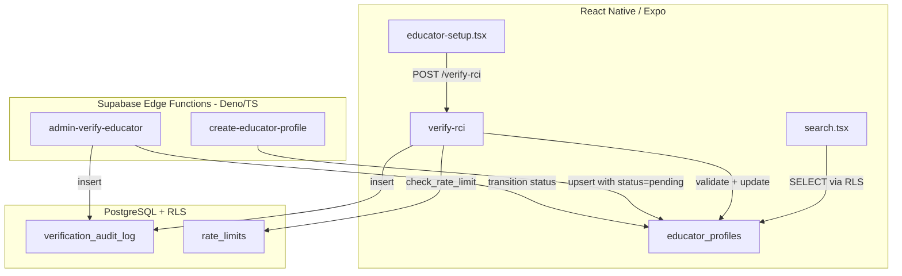
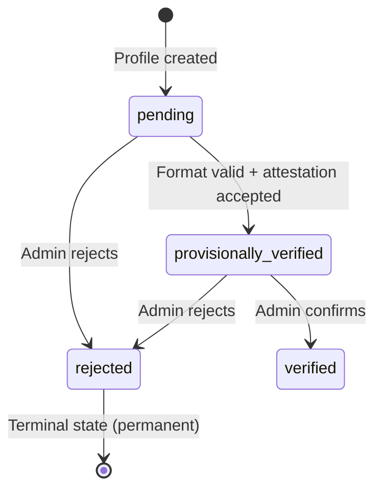

# Design Document: RCI Verification System

## Overview

The RCI Verification System replaces V-SPED's placeholder `verify-rci` edge function with a production-grade multi-stage credential verification pipeline. Since the RCI portal has no public API, the system uses **Format Validation + Self-Attestation + Delayed Manual Audit**.

**Core flow:**
1. Educator submits CRR number → format validated → normalized and stored
2. Educator accepts self-attestation → status transitions to `provisionally_verified`
3. Educator becomes visible in marketplace with "Verification Pending" badge
4. Platform admin manually audits → transitions to `verified` or `rejected`

The system adds new columns to the existing `educator_profiles` table, creates a `verification_audit_log` table, updates the `verify-rci` and `create-educator-profile` edge functions, creates a new `admin-verify-educator` edge function, and updates the frontend onboarding + marketplace screens.

## Architecture



**State Machine:**



## Components and Interfaces

### 1. CRR Format Validator (Pure Function)

A pure validation function extracted for testability. Validates CRR numbers against known RCI patterns.

**Interface:**
```typescript
interface ValidationResult {
  valid: boolean;
  normalized?: string;       // Uppercase, trimmed CRR if valid
  error?: string;            // Descriptive error if invalid
  errorComponent?: 'prefix' | 'category' | 'digits' | 'length' | 'format';
}

function validateCrrFormat(crrNumber: string): ValidationResult;
```

**Format rules:**
- Alphanumeric, 4–20 characters after trimming
- Must contain at least one letter and one digit
- Accepted category prefixes: `SE`, `AST`, `CP`, `RP`, `PO`, `SHT`, `CBR`, `RCA`, `MRT`, `RSW`, `RPMR`, `OMS`, `HEMT`, `RET`
- Pattern: `[A-Z]{2,4}[/-]?[0-9]{3,10}[/-]?[A-Z0-9]{0,6}` (flexible to accommodate state variations)
- Normalized to uppercase with internal whitespace removed

### 2. Updated `verify-rci` Edge Function

**Endpoint:** `POST /functions/v1/verify-rci`

**Request body:**
```typescript
interface VerifyRciRequest {
  attestation_accepted: boolean;   // Must be true
}
```

**Logic flow:**
1. Authenticate user (JWT from Authorization header)
2. Rate limit check: `check_rate_limit(user_id, 'verify_rci', 3, 60)`
3. Fetch educator profile — if not found, return 404
4. Check if already rejected → return 403 (generic error, no details)
5. Check if already verified/provisionally_verified → return success with current status
6. Validate `attestation_accepted === true` → return 400 if false
7. Validate CRR number format via `validateCrrFormat(profile.rci_number)`
8. Check uniqueness — no other profile has the same normalized CRR
9. Update profile: `verification_status = 'provisionally_verified'`, `is_verified = true`, `self_attestation_at = NOW()`, store attestation text
10. Insert audit log entry
11. Return success with new status

**Response:**
```typescript
interface VerifyRciResponse {
  success: boolean;
  verification_status?: 'provisionally_verified' | 'verified' | 'rejected';
  message: string;
  already_verified?: boolean;
}
```

### 3. Updated `create-educator-profile` Edge Function

**Change:** After upserting the educator profile, explicitly set `verification_status = 'pending'` for new profiles.

### 4. New `admin-verify-educator` Edge Function

**Endpoint:** `POST /functions/v1/admin-verify-educator`

**Request body:**
```typescript
interface AdminVerifyRequest {
  educator_id: string;          // UUID of the educator
  action: 'verify' | 'reject';
  reason?: string;              // Required for reject, optional for verify
  notes?: string;               // Admin notes
}
```

**Logic flow:**
1. Authenticate admin (JWT + check `role = 'admin'` in users table)
2. Fetch educator profile
3. Validate state transition is allowed
4. For rejection: require `reason` field; if `reason === 'fraudulent_crr'`, mark as permanent ban
5. Update profile: set new `verification_status`, `verified_by`, `rejection_reason`, `audit_notes`
6. Update `is_verified`: TRUE for `verified`/`provisionally_verified`, FALSE for `rejected`
7. Insert audit log entry with admin's user_id, IP, reason
8. Return success

### 5. Admin Queue Query

The admin endpoint also supports `GET` to list educators pending review:

**Query parameters:** `?status=provisionally_verified&category=SE&city=Mumbai&from_date=2026-01-01&to_date=2026-12-31`

**Returns:** Paginated list of educator profiles with their CRR numbers, submission dates, categories, and cities.

## Data Models

### Modified `educator_profiles` Table (New Columns)

```sql
-- New columns added to existing educator_profiles table
verification_status TEXT NOT NULL DEFAULT 'pending'
  CHECK (verification_status IN ('pending', 'provisionally_verified', 'verified', 'rejected'));
self_attestation_at TIMESTAMPTZ;
attestation_text TEXT;
rejection_reason TEXT;
verified_by UUID REFERENCES auth.users(id);
audit_notes TEXT;
```

### New `verification_audit_log` Table

```sql
CREATE TABLE public.verification_audit_log (
  id UUID PRIMARY KEY DEFAULT gen_random_uuid(),
  educator_id UUID NOT NULL REFERENCES public.educator_profiles(id),
  previous_status TEXT NOT NULL,
  new_status TEXT NOT NULL,
  changed_at TIMESTAMPTZ NOT NULL DEFAULT NOW(),
  actor_id UUID NOT NULL REFERENCES auth.users(id),
  actor_type TEXT NOT NULL CHECK (actor_type IN ('educator', 'admin', 'system')),
  reason TEXT,
  ip_address TEXT,
  metadata JSONB DEFAULT '{}'
);
```

**RLS:** No user-facing policies (service_role only). Append-only enforced by having no UPDATE/DELETE policies.

### Updated RLS Policy

```sql
-- Replace existing educator_profiles_public_browse
CREATE POLICY educator_profiles_public_browse ON public.educator_profiles
  FOR SELECT USING (
    verification_status IN ('provisionally_verified', 'verified')
    AND subscription_status = 'active'
  );
```

### Attestation Text Constant

```typescript
const ATTESTATION_TEXT = 
  "I hereby declare that the CRR number provided is genuine, currently valid, " +
  "and registered under my name with the Rehabilitation Council of India. " +
  "I understand that providing false information may result in permanent ban " +
  "from this platform and legal action under applicable Indian law including " +
  "the Information Technology Act, 2000 and Indian Penal Code.";
```

## Correctness Properties

*A property is a characteristic or behavior that should hold true across all valid executions of a system — essentially, a formal statement about what the system should do. Properties serve as the bridge between human-readable specifications and machine-verifiable correctness guarantees.*

### Property 1: CRR Format Validation Correctness

*For any* string input to `validateCrrFormat`, the function SHALL return `valid: true` with a normalized uppercase/trimmed string if and only if the input (after trimming/uppercasing) matches the expected CRR pattern (contains at least one letter and one digit, is 4-20 chars, and matches a recognized category prefix followed by digits). For invalid inputs, the error message SHALL reference the specific failing component.

**Validates: Requirements 1.1, 1.2, 1.4**

### Property 2: CRR Uniqueness Enforcement

*For any* two distinct educator user IDs and the same normalized CRR number, the Verification_System SHALL accept the first submission and reject the second with a duplicate error. The normalized form is used for comparison (case-insensitive, whitespace-insensitive).

**Validates: Requirements 1.5**

### Property 3: State Machine Transition Validity

*For any* educator profile with a given `verification_status` and any attempted transition, the system SHALL succeed if and only if the transition is in the allowed set: {(pending → provisionally_verified), (pending → rejected), (provisionally_verified → verified), (provisionally_verified → rejected)}. All other transitions SHALL be rejected. Additionally, rejection transitions SHALL require a non-empty reason string.

**Validates: Requirements 3.2, 3.3, 3.4, 3.5, 3.6, 7.1**

### Property 4: Attestation Gate

*For any* verification attempt where `attestation_accepted` is false or missing, the system SHALL keep the educator's status at `pending` and not advance the state. For any attempt where `attestation_accepted` is true and the CRR format is valid, the attestation text, timestamp, and user ID SHALL all be stored.

**Validates: Requirements 2.2, 2.4**

### Property 5: Marketplace Visibility Rules

*For any* educator profile, it SHALL be visible in marketplace search results if and only if `verification_status` is in `('provisionally_verified', 'verified')` AND `subscription_status` is `'active'`. All other combinations SHALL result in exclusion from search results.

**Validates: Requirements 4.1, 4.2, 4.3, 4.4**

### Property 6: Audit Trail Completeness

*For any* successful verification status transition, the system SHALL create exactly one audit log entry containing: educator_id, previous_status, new_status, timestamp, actor_id, actor_type, and a non-null IP/context field. For rejection actions, the audit entry SHALL also contain the rejection reason.

**Validates: Requirements 5.1, 5.3, 5.4**

### Property 7: Backward Compatibility Invariant

*For any* state transition, the `is_verified` column SHALL be set to `TRUE` when `verification_status` transitions to `provisionally_verified` or `verified`, and SHALL be set to `FALSE` when `verification_status` transitions to `rejected` or remains `pending`.

**Validates: Requirements 9.3**

### Property 8: Rejected Educator Information Hiding

*For any* educator with `verification_status = 'rejected'` who calls the verify-rci endpoint, the response SHALL contain a generic "account banned" error message and SHALL NOT include the specific rejection reason, rejection timestamp, or admin notes.

**Validates: Requirements 7.3**

### Property 9: Admin Queue Correctness

*For any* set of educators with mixed verification statuses, the admin list endpoint SHALL return only those with `verification_status = 'provisionally_verified'`, ordered by submission date ascending. When filters are applied (category, city, date range), only matching records SHALL appear in results.

**Validates: Requirements 6.1, 6.3**

## Error Handling

| Scenario | HTTP Status | Response |
|----------|-------------|----------|
| No auth header | 401 | `{ success: false, message: "Unauthorized" }` |
| Invalid JWT | 401 | `{ success: false, message: "Unauthorized" }` |
| Profile not found | 404 | `{ success: false, message: "Educator profile not found" }` |
| Rate limit exceeded | 429 | `{ success: false, message: "Too many attempts. Please try again later." }` |
| CRR format invalid | 400 | `{ success: false, message: "Invalid CRR format: [component] is incorrect", errorComponent: "..." }` |
| Attestation not accepted | 400 | `{ success: false, message: "Self-attestation must be accepted to proceed" }` |
| Duplicate CRR number | 409 | `{ success: false, message: "This CRR number is already registered on the platform" }` |
| Account rejected/banned | 403 | `{ success: false, message: "This account cannot perform verification" }` |
| Invalid state transition | 422 | `{ success: false, message: "Invalid status transition" }` |
| Admin: missing reason for reject | 400 | `{ success: false, message: "Rejection reason is required" }` |
| Admin: not authorized | 403 | `{ success: false, message: "Admin access required" }` |
| Server error | 500 | `{ success: false, message: "Server error" }` |

## Testing Strategy

### Property-Based Testing

**Library:** [fast-check](https://fast-check.dev/) (via esm.sh for Deno compatibility in edge function tests, or npm for local test runner)

**Configuration:** Minimum 100 iterations per property test.

**Tag format:** `Feature: rci-verification, Property N: [title]`

The CRR format validator is a pure function ideal for PBT — it has a large input space (arbitrary strings) and clear valid/invalid boundaries. The state machine transition logic is also well-suited since we can generate all (state, action) combinations.

### Unit Tests (Example-Based)

- All 14 category codes pass validation (exhaustive enumeration)
- Specific known-good CRR formats pass
- Rate limiting returns 429 after 3 attempts
- Attestation text constant contains required legal language
- Admin endpoint rejects non-admin users

### Integration Tests

- End-to-end flow: create profile → verify RCI → check marketplace visibility
- Admin flow: list queue → verify educator → check badge
- Rejection flow: admin rejects → educator cannot retry → hidden from marketplace

### Test Environment

- Use Deno test runner (`deno test`) for edge function unit tests
- Use fast-check via `https://esm.sh/fast-check@3.22.0` for property tests in Deno
- Mock Supabase client for isolated function testing
- Use actual Supabase local dev for integration tests
