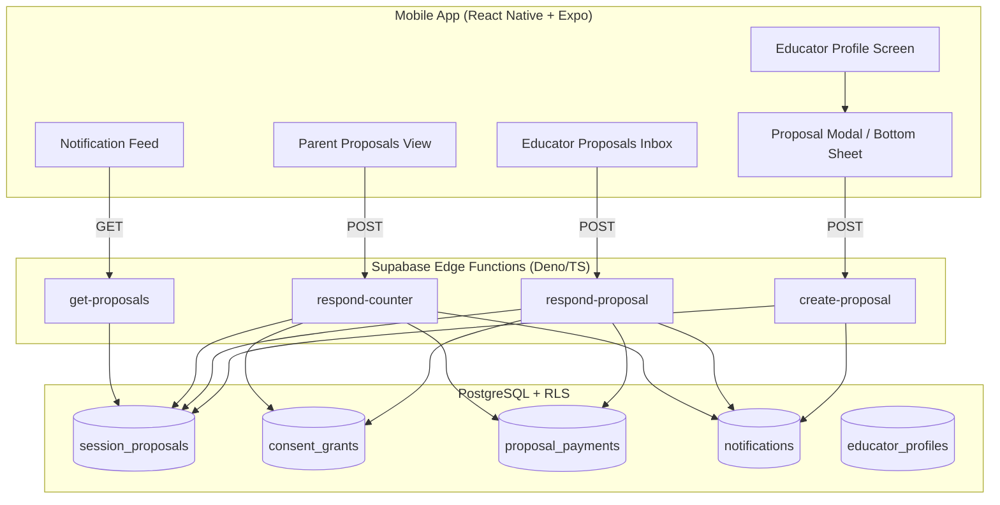
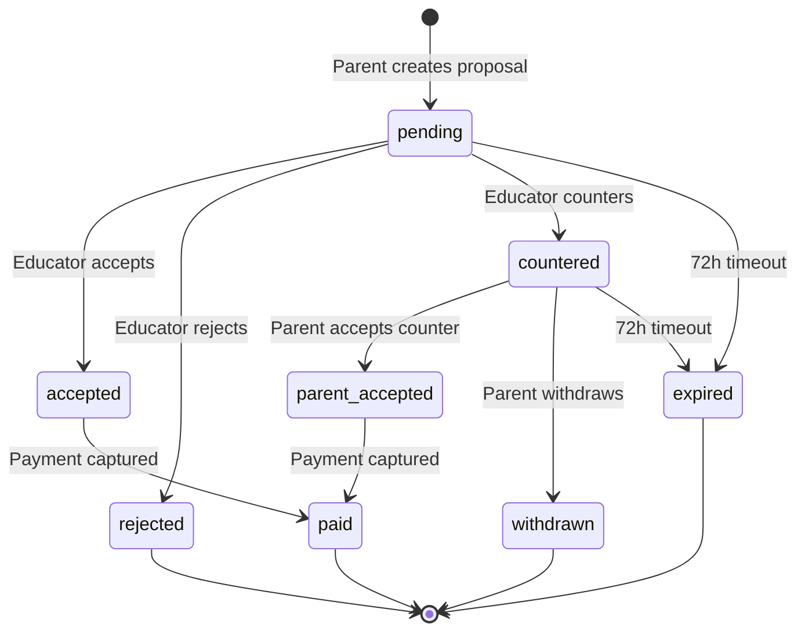
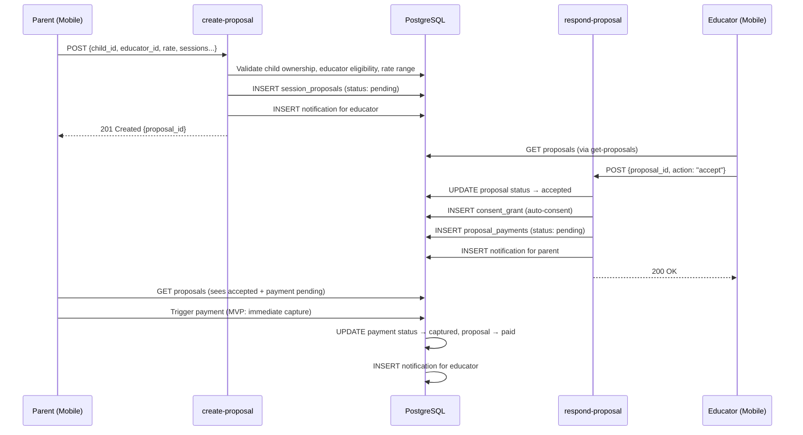
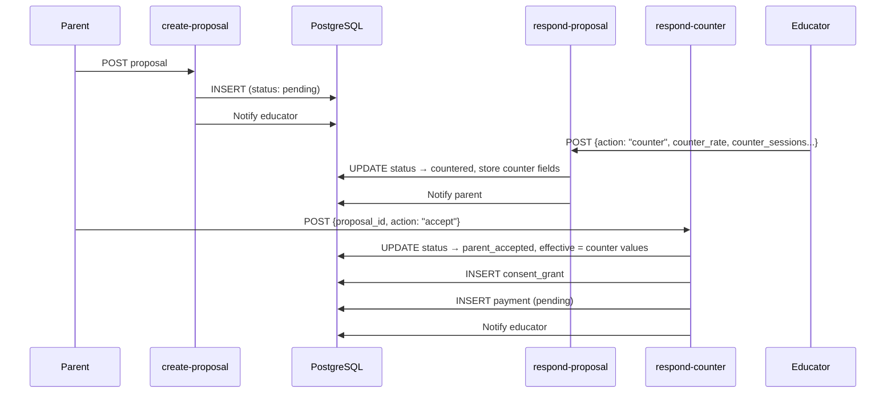

# Design Document: Session Proposal and Booking

## Overview

This design introduces a parent-initiated session proposal and booking flow that complements the existing educator-initiated flow. The system allows parents to browse educator profiles, propose session packages (multiple sessions at a negotiated rate), and negotiate terms through accept/reject/counter mechanics. Upon agreement, data consent is automatically granted, payment is triggered (stubbed for MVP), and the booking is confirmed.

The design preserves full backward compatibility with the existing `propose-session` and `respond-session` edge functions (educator-initiated flow). It introduces a new `session_proposals` table that represents a "package deal" sitting above individual sessions, a notifications table for in-app event communication, and a payments table for tracking proposal-linked payments.

### Key Design Decisions

| Decision | Rationale |
|----------|-----------|
| Separate `session_proposals` table (not reusing `sessions`) | Proposals represent package deals (X sessions at rate Y); individual sessions are scheduled *after* payment. Different lifecycle, different data shape. |
| Auto-consent on acceptance | Parent initiated the proposal — implicit consent intent. Time-bound, revocable, DPDP-compliant. No separate consent request needed. |
| `min_rate_inr` hidden via RLS | Parents never see the floor price. Soft warning uses only the public `session_rate_inr`. |
| 72h expiry via DB function + scheduled invocation | Lightweight; no external job scheduler needed. Supabase pg_cron or a scheduled edge function calls the expiry function. |
| Payment stub (immediate capture) | Razorpay integration is deferred. MVP marks payment as captured instantly to unblock the flow. |
| In-app notifications only (no push for MVP) | Reduces complexity. Notifications stored in DB, rendered in-app. Push can be layered later. |

## Architecture

### System Context



### Proposal Lifecycle State Machine



### Sequence Diagram: Happy Path (Direct Accept)



### Sequence Diagram: Counter-Proposal Flow



## Components and Interfaces

### Edge Function: `create-proposal`

**Method:** POST  
**Auth:** Bearer token (parent)  
**Rate Limit:** 10 proposals per 60 minutes per user

**Request Body:**
```typescript
interface CreateProposalRequest {
  child_id: string;          // UUID
  educator_id: string;       // UUID
  sessions_per_week: number; // 1-7
  total_sessions: number;    // minimum 1
  proposed_rate_inr: number; // integer, >= 1
  notes?: string;            // max 500 chars
}
```

**Response (201):**
```typescript
interface CreateProposalResponse {
  success: true;
  proposal_id: string;
  status: "pending";
  total_cost: number;
  gst_amount: number;
  grand_total: number;
  expires_at: string; // ISO timestamp (created_at + 72h)
}
```

**Validation Logic:**
1. Authenticate user
2. Rate limit check: `check_rate_limit(user.id, 'create_proposal', 10, 60)`
3. Verify `child_id` belongs to `auth.uid()` (query `children` table)
4. Verify educator has `verification_status IN ('provisionally_verified', 'verified')` AND `subscription_status = 'active'`
5. Fetch educator's `min_rate_inr` (service_role access)
6. Reject if `proposed_rate_inr < min_rate_inr`
7. Validate: `sessions_per_week` 1-7, `total_sessions` >= 1, `notes` <= 500 chars
8. Insert `session_proposals` record with `status = 'pending'`, `expires_at = NOW() + 72h`
9. Insert notification for educator
10. Return proposal summary with cost breakdown

**Error Responses:**

| Status | Condition |
|--------|-----------|
| 400 | Missing required fields, invalid range, notes too long |
| 401 | No auth / invalid token |
| 403 | Child doesn't belong to parent |
| 403 | Rate below educator's minimum |
| 422 | Educator not eligible (unverified or no subscription) |
| 429 | Rate limit exceeded |
| 500 | Database error |

---

### Edge Function: `respond-proposal`

**Method:** POST  
**Auth:** Bearer token (educator)

**Request Body:**
```typescript
interface RespondProposalRequest {
  proposal_id: string;
  action: "accept" | "reject" | "counter";
  // Required if action === "counter":
  counter_rate_inr?: number;
  counter_sessions_per_week?: number;
  counter_total_sessions?: number;
  counter_notes?: string; // max 500 chars
  // Optional if action === "reject":
  rejection_reason?: string;
}
```

**Response (200):**
```typescript
interface RespondProposalResponse {
  success: true;
  proposal_id: string;
  new_status: "accepted" | "rejected" | "countered";
  consent_grant_id?: string;  // present if accepted
  payment_id?: string;        // present if accepted
}
```

**Validation Logic:**
1. Authenticate user
2. Fetch proposal where `educator_id = auth.uid()` AND `status = 'pending'`
3. For "counter": validate `counter_rate_inr >= educator's min_rate_inr`, counter fields required
4. For "accept": transition to `accepted`, create consent_grant, create payment record, notify parent
5. For "reject": transition to `rejected`, record reason, notify parent
6. For "counter": transition to `countered`, store counter fields, reset `expires_at` to NOW() + 72h, notify parent

---

### Edge Function: `respond-counter`

**Method:** POST  
**Auth:** Bearer token (parent)

**Request Body:**
```typescript
interface RespondCounterRequest {
  proposal_id: string;
  action: "accept" | "withdraw";
}
```

**Response (200):**
```typescript
interface RespondCounterResponse {
  success: true;
  proposal_id: string;
  new_status: "parent_accepted" | "withdrawn";
  consent_grant_id?: string;  // present if accepted
  payment_id?: string;        // present if accepted
}
```

**Validation Logic:**
1. Authenticate user
2. Fetch proposal where `parent_id = auth.uid()` AND `status = 'countered'`
3. For "accept": transition to `parent_accepted`, copy counter values as effective values, create consent_grant, create payment, notify educator
4. For "withdraw": transition to `withdrawn`, notify educator

---

### Edge Function: `get-proposals`

**Method:** GET  
**Auth:** Bearer token (parent or educator)  
**Query Params:** `?role=parent|educator&status=pending,countered,accepted`

**Response (200):**
```typescript
interface GetProposalsResponse {
  success: true;
  proposals: ProposalSummary[];
}

interface ProposalSummary {
  id: string;
  status: string;
  // For parents: educator name, rate, sessions
  // For educators: parent name (NOT child name until consent granted), rate, sessions
  educator_name?: string;
  parent_name?: string;
  child_name?: string; // Only if consent_grant is active
  sessions_per_week: number;
  total_sessions: number;
  proposed_rate_inr: number;
  counter_rate_inr?: number;
  counter_sessions_per_week?: number;
  counter_total_sessions?: number;
  notes?: string;
  created_at: string;
  expires_at: string;
  payment_status?: string;
}
```

**Privacy Note:** Per the child-data-privacy steering rule, the educator NEVER sees child data (name, details) until a consent_grant is active. Before acceptance, proposals show only `parent_name` and anonymized identifiers to the educator.

---

### Frontend Components

#### ProposalBottomSheet (on educator-profile.tsx)

```typescript
interface ProposalBottomSheetProps {
  educatorId: string;
  educatorName: string;
  listedRate: number;
  isVisible: boolean;
  onClose: () => void;
  onSubmitted: (proposalId: string) => void;
}
```

Fields:
- Child selector (dropdown if multiple children, auto-selected if one)
- Sessions per week (stepper: 1-7)
- Total sessions (numeric input, min 1)
- Proposed rate (pre-filled with listed rate, editable, integer)
- Notes (optional text area, max 500 chars)
- Cost breakdown display: subtotal, GST (18%), grand total
- Soft warning text (shown when rate < listed rate)
- Submit button (disabled until valid)

#### EducatorProposalsInbox

Displays in educator dashboard. Groups proposals by status:
1. **Pending** (action required) — shown first with accept/reject/counter actions
2. **Countered** (awaiting parent) — shown as "waiting" state
3. **Historical** (accepted, rejected, expired, withdrawn) — collapsible

Badge count of pending proposals shown on navigation tab.

#### ParentProposalsView

Displays in parent dashboard. Shows all proposals chronologically:
- **Status indicators:** pending (yellow/accent), accepted (green/success), rejected (red/warning), countered (blue/secondary), expired (grey/textLight)
- **Counter-offer view:** shows original vs counter terms side-by-side with Accept/Withdraw buttons
- **Payment prompt:** for accepted proposals with pending payment

## Data Models

### New Table: `session_proposals`

```sql
CREATE TABLE public.session_proposals (
  id UUID PRIMARY KEY DEFAULT gen_random_uuid(),
  parent_id UUID NOT NULL REFERENCES public.users(id),
  child_id UUID NOT NULL REFERENCES public.children(id),
  educator_id UUID NOT NULL REFERENCES public.users(id),
  
  -- Original proposal terms
  sessions_per_week INTEGER NOT NULL CHECK (sessions_per_week BETWEEN 1 AND 7),
  total_sessions INTEGER NOT NULL CHECK (total_sessions >= 1),
  proposed_rate_inr INTEGER NOT NULL CHECK (proposed_rate_inr >= 1),
  notes TEXT CHECK (char_length(notes) <= 500),
  
  -- Lifecycle
  status TEXT NOT NULL DEFAULT 'pending' CHECK (status IN (
    'pending', 'accepted', 'rejected', 'countered', 
    'parent_accepted', 'withdrawn', 'expired', 'paid'
  )),
  
  -- Counter-proposal fields (populated by educator)
  counter_rate_inr INTEGER CHECK (counter_rate_inr >= 1),
  counter_sessions_per_week INTEGER CHECK (counter_sessions_per_week BETWEEN 1 AND 7),
  counter_total_sessions INTEGER CHECK (counter_total_sessions >= 1),
  counter_notes TEXT CHECK (char_length(counter_notes) <= 500),
  
  -- Linked records
  consent_grant_id UUID REFERENCES public.consent_grants(id),
  payment_id UUID,
  
  -- Timestamps
  created_at TIMESTAMPTZ NOT NULL DEFAULT NOW(),
  responded_at TIMESTAMPTZ,
  paid_at TIMESTAMPTZ,
  expires_at TIMESTAMPTZ NOT NULL DEFAULT (NOW() + INTERVAL '72 hours'),
  
  -- Constraints
  CONSTRAINT valid_counter_fields CHECK (
    (status != 'countered') OR 
    (counter_rate_inr IS NOT NULL AND counter_sessions_per_week IS NOT NULL AND counter_total_sessions IS NOT NULL)
  )
);

-- Indexes
CREATE INDEX idx_proposals_educator_status ON public.session_proposals(educator_id, status);
CREATE INDEX idx_proposals_parent_status ON public.session_proposals(parent_id, status);
CREATE INDEX idx_proposals_expiry ON public.session_proposals(status, expires_at) 
  WHERE status IN ('pending', 'countered');
```

**RLS Policies:**
```sql
ALTER TABLE public.session_proposals ENABLE ROW LEVEL SECURITY;

-- Parents can view and create their own proposals
CREATE POLICY proposals_parent_select ON public.session_proposals
  FOR SELECT USING (parent_id = auth.uid());

CREATE POLICY proposals_parent_insert ON public.session_proposals
  FOR INSERT WITH CHECK (parent_id = auth.uid());

-- Educators can view and update proposals addressed to them
CREATE POLICY proposals_educator_select ON public.session_proposals
  FOR SELECT USING (educator_id = auth.uid());

CREATE POLICY proposals_educator_update ON public.session_proposals
  FOR UPDATE USING (educator_id = auth.uid());
```

---

### New Table: `proposal_payments`

```sql
CREATE TABLE public.proposal_payments (
  id UUID PRIMARY KEY DEFAULT gen_random_uuid(),
  proposal_id UUID NOT NULL REFERENCES public.session_proposals(id),
  parent_id UUID NOT NULL REFERENCES public.users(id),
  educator_id UUID NOT NULL REFERENCES public.users(id),
  
  -- Amount breakdown
  sessions_count INTEGER NOT NULL,
  rate_per_session INTEGER NOT NULL,
  subtotal_inr INTEGER NOT NULL,       -- sessions_count × rate_per_session
  gst_inr INTEGER NOT NULL,            -- subtotal × 0.18 (rounded)
  total_inr INTEGER NOT NULL,          -- subtotal + gst
  
  -- Payment state
  status TEXT NOT NULL DEFAULT 'pending' CHECK (status IN ('pending', 'captured', 'failed', 'refunded')),
  razorpay_payment_id TEXT,            -- NULL for MVP stub
  razorpay_order_id TEXT,              -- NULL for MVP stub
  
  -- Timestamps
  created_at TIMESTAMPTZ NOT NULL DEFAULT NOW(),
  captured_at TIMESTAMPTZ
);

CREATE INDEX idx_proposal_payments_proposal ON public.proposal_payments(proposal_id);
CREATE INDEX idx_proposal_payments_parent ON public.proposal_payments(parent_id, status);
```

**RLS Policies:**
```sql
ALTER TABLE public.proposal_payments ENABLE ROW LEVEL SECURITY;

CREATE POLICY payments_parent_select ON public.proposal_payments
  FOR SELECT USING (parent_id = auth.uid());

CREATE POLICY payments_educator_select ON public.proposal_payments
  FOR SELECT USING (educator_id = auth.uid());
-- Inserts and updates handled by service_role (edge functions)
```

---

### New Table: `notifications`

```sql
CREATE TABLE public.notifications (
  id UUID PRIMARY KEY DEFAULT gen_random_uuid(),
  user_id UUID NOT NULL REFERENCES public.users(id),
  type TEXT NOT NULL CHECK (type IN (
    'proposal_received',      -- educator gets new proposal
    'proposal_accepted',      -- parent gets acceptance
    'proposal_rejected',      -- parent gets rejection
    'proposal_countered',     -- parent gets counter-offer
    'counter_accepted',       -- educator gets parent's counter acceptance
    'counter_withdrawn',      -- educator gets parent's withdrawal
    'proposal_expired',       -- both parties
    'payment_completed',      -- educator gets payment confirmation
    'payment_reminder'        -- parent gets payment reminder
  )),
  title TEXT NOT NULL,
  body TEXT NOT NULL,
  metadata JSONB DEFAULT '{}',  -- {proposal_id, educator_id, parent_id, etc.}
  read_at TIMESTAMPTZ,
  created_at TIMESTAMPTZ NOT NULL DEFAULT NOW()
);

CREATE INDEX idx_notifications_user ON public.notifications(user_id, created_at DESC);
CREATE INDEX idx_notifications_unread ON public.notifications(user_id) WHERE read_at IS NULL;
```

**RLS Policies:**
```sql
ALTER TABLE public.notifications ENABLE ROW LEVEL SECURITY;

CREATE POLICY notifications_own_select ON public.notifications
  FOR SELECT USING (user_id = auth.uid());

CREATE POLICY notifications_own_update ON public.notifications
  FOR UPDATE USING (user_id = auth.uid());
-- Inserts by service_role only (edge functions create notifications)
```

---

### Schema Modifications: `educator_profiles`

```sql
-- Add min_rate_inr column
ALTER TABLE public.educator_profiles 
  ADD COLUMN IF NOT EXISTS min_rate_inr INTEGER;

-- Add constraints
ALTER TABLE public.educator_profiles
  ADD CONSTRAINT chk_min_rate_positive CHECK (min_rate_inr > 0),
  ADD CONSTRAINT chk_min_rate_within_range CHECK (min_rate_inr >= session_rate_inr - 100);
```

**RLS Update:** The existing `educator_profiles_public_browse` policy must be updated to exclude `min_rate_inr` from parent-visible queries. Since PostgreSQL RLS operates at the row level (not column level), we enforce column-level hiding at the **view** or **edge function** level:

```sql
-- Create a view for parent-facing educator data (excludes min_rate_inr)
CREATE OR REPLACE VIEW public.educator_profiles_public AS
  SELECT id, bio, subjects, languages, city, session_rate_inr, 
         max_group_size, rating, is_verified, subscription_status
  FROM public.educator_profiles
  WHERE is_verified = TRUE AND subscription_status = 'active';
```

The `get-proposals` and `create-proposal` edge functions use `service_role` to access `min_rate_inr` for validation, never exposing it in responses.

---

### Schema Modification: `consent_grants`

```sql
-- Add proposal_id reference column
ALTER TABLE public.consent_grants
  ADD COLUMN IF NOT EXISTS proposal_id UUID REFERENCES public.session_proposals(id);

-- Make expires_at nullable for proposal-linked grants (expiry tied to session completion)
ALTER TABLE public.consent_grants
  ALTER COLUMN expires_at DROP NOT NULL;

-- Drop the old check constraint and add a relaxed one
ALTER TABLE public.consent_grants
  DROP CONSTRAINT IF EXISTS grant_not_expired_at_creation;

ALTER TABLE public.consent_grants
  ADD CONSTRAINT grant_expires_valid CHECK (
    expires_at IS NULL OR expires_at > granted_at
  );
```

**Auto-consent grant fields for proposals:**
- `request_id`: References a synthetic consent_request created for audit trail
- `child_id`: From the proposal
- `parent_id`: From the proposal
- `grantee_id`: The educator
- `scope`: `['progress', 'session_notes']`
- `expires_at`: NULL initially; set to last session completion + 7 days
- `proposal_id`: Links back to the session_proposals record
- `purpose`: "Session package: X sessions at ₹Y/session" (stored in consent_request.reason)

---

### Expiry Function

```sql
CREATE OR REPLACE FUNCTION public.expire_stale_proposals()
RETURNS INTEGER AS $$
DECLARE
  expired_count INTEGER;
BEGIN
  UPDATE public.session_proposals
  SET status = 'expired'
  WHERE status IN ('pending', 'countered')
    AND expires_at <= NOW();
  
  GET DIAGNOSTICS expired_count = ROW_COUNT;
  
  -- Create notifications for expired proposals
  INSERT INTO public.notifications (user_id, type, title, body, metadata)
  SELECT 
    parent_id, 'proposal_expired', 
    'Proposal Expired', 
    'Your session proposal has expired without a response.',
    jsonb_build_object('proposal_id', id)
  FROM public.session_proposals
  WHERE status = 'expired' AND expires_at <= NOW() 
    AND expires_at > NOW() - INTERVAL '5 minutes'; -- only newly expired

  INSERT INTO public.notifications (user_id, type, title, body, metadata)
  SELECT 
    educator_id, 'proposal_expired',
    'Proposal Expired',
    'A session proposal has expired.',
    jsonb_build_object('proposal_id', id)
  FROM public.session_proposals
  WHERE status = 'expired' AND expires_at <= NOW()
    AND expires_at > NOW() - INTERVAL '5 minutes';

  RETURN expired_count;
END;
$$ LANGUAGE plpgsql SECURITY DEFINER;
```

Invoked via Supabase pg_cron (every 5 minutes) or a scheduled edge function.


## Correctness Properties

*A property is a characteristic or behavior that should hold true across all valid executions of a system — essentially, a formal statement about what the system should do. Properties serve as the bridge between human-readable specifications and machine-verifiable correctness guarantees.*

### Property 1: Rate Constraint Validation

*For any* pair (session_rate_inr, min_rate_inr) where min_rate_inr < session_rate_inr - 100 OR min_rate_inr <= 0, the system SHALL reject the rate configuration. Conversely, for any pair where min_rate_inr >= session_rate_inr - 100 AND min_rate_inr > 0, the system SHALL accept it. This applies to profile creation, profile updates, proposal creation (proposed_rate vs min_rate), and counter-proposals (counter_rate vs min_rate).

**Validates: Requirements 1.2, 1.3, 1.6, 2.3, 2.4, 4.5, 12.3**

### Property 2: Minimum Rate Never Exposed to Parents

*For any* API response returned to a user with role `parent`, the response payload SHALL NOT contain the field `min_rate_inr` or its value for any educator.

**Validates: Requirements 1.5, 10.5**

### Property 3: Cost Calculation Correctness

*For any* positive integers (total_sessions, rate_per_session), the system SHALL compute: subtotal = total_sessions × rate_per_session, gst = round(subtotal × 0.18), grand_total = subtotal + gst. This applies to proposal display, payment record creation, and frontend cost breakdown.

**Validates: Requirements 2.5, 2.6, 7.2**

### Property 4: New Proposals Start as Pending

*For any* valid proposal creation request, the resulting `session_proposals` record SHALL have status = 'pending', a non-null `created_at` timestamp, and `expires_at` = created_at + 72 hours.

**Validates: Requirements 2.8**

### Property 5: Child Ownership Enforcement

*For any* proposal creation request where the specified `child_id` does not have `parent_id` matching the authenticated user, the system SHALL reject the request with a 403 error.

**Validates: Requirements 2.9**

### Property 6: Educator Eligibility Gate

*For any* proposal targeting an educator whose `verification_status` is NOT in ('provisionally_verified', 'verified') OR whose `subscription_status` is NOT 'active', the system SHALL reject the proposal with a 422 error.

**Validates: Requirements 2.10**

### Property 7: Soft Warning Determination

*For any* (proposed_rate, listed_rate) pair, the frontend SHALL display a rate warning if and only if proposed_rate < listed_rate. The warning logic SHALL use only the listed_rate value (publicly available), never the min_rate_inr.

**Validates: Requirements 3.1, 3.2, 3.3**

### Property 8: Valid State Transitions from Pending

*For any* proposal with status = 'pending', an educator response SHALL produce exactly one of: (a) status = 'accepted' with responded_at set, (b) status = 'rejected' with responded_at set, or (c) status = 'countered' with counter_rate_inr, counter_sessions_per_week, counter_total_sessions all non-null and responded_at set. No other status transitions are valid from pending via educator action.

**Validates: Requirements 4.2, 4.3, 4.4**

### Property 9: State Guards Prevent Invalid Actions

*For any* proposal whose status is NOT 'pending', an educator respond action SHALL be rejected. *For any* proposal whose status is NOT 'countered', a parent respond-counter action SHALL be rejected. The system SHALL return a 400 error in both cases.

**Validates: Requirements 4.6, 5.4**

### Property 10: Authorization Enforcement

*For any* educator respond action where the authenticated user's ID does NOT match the proposal's `educator_id`, the system SHALL reject the action. *For any* parent respond-counter action where the authenticated user's ID does NOT match the proposal's `parent_id`, the system SHALL reject the action.

**Validates: Requirements 4.7, 5.5**

### Property 11: Parent Counter-Response Transitions

*For any* proposal with status = 'countered', a parent "accept" action SHALL transition the status to 'parent_accepted' with effective values set to the counter values. A parent "withdraw" action SHALL transition the status to 'withdrawn'. No consent_grant or payment is created for withdrawal.

**Validates: Requirements 5.2, 5.3**

### Property 12: Auto-Consent on Acceptance

*For any* proposal that transitions to 'accepted' or 'parent_accepted', the system SHALL create a `consent_grant` record with: grantee_id = proposal.educator_id, child_id = proposal.child_id, parent_id = proposal.parent_id, expires_at = NULL, proposal_id = proposal.id, and scope = ['progress', 'session_notes']. The associated consent_request purpose SHALL contain the session count and rate.

**Validates: Requirements 6.1, 6.2, 6.3, 6.4**

### Property 13: Consent Expiry on Package Completion

*For any* accepted proposal where all linked sessions are marked 'completed', the system SHALL set the associated consent_grant's `expires_at` to the last session's completed_at timestamp plus exactly 7 days.

**Validates: Requirements 6.5**

### Property 14: No Consent or Payment on Terminal States

*For any* proposal that reaches status 'rejected', 'withdrawn', or 'expired', the system SHALL NOT have created a consent_grant or a proposal_payment record linked to that proposal.

**Validates: Requirements 6.7, 9.4**

### Property 15: Payment Record on Acceptance

*For any* proposal that transitions to 'accepted' or 'parent_accepted', the system SHALL create a `proposal_payments` record with status = 'pending', correct amount breakdown (subtotal, GST, total), and link to the proposal.

**Validates: Requirements 7.1**

### Property 16: Payment Capture Transitions Proposal to Paid

*For any* proposal_payment with status = 'pending', when payment is captured the payment status SHALL become 'captured', the proposal status SHALL become 'paid', and the proposal's `paid_at` SHALL be set.

**Validates: Requirements 7.4**

### Property 17: Sessions Blocked Until Payment Captured

*For any* accepted proposal whose linked payment status is NOT 'captured', the system SHALL prevent scheduling of individual sessions.

**Validates: Requirements 7.5**

### Property 18: Notifications on Lifecycle Events

*For any* proposal lifecycle transition (created → notify educator; responded → notify parent; counter-responded → notify educator; payment captured → notify educator), the system SHALL create a notification record for the counterparty with a non-null title, body, created_at, and metadata containing the proposal_id.

**Validates: Requirements 8.1, 8.2, 8.3, 8.5**

### Property 19: Proposal Expiry After 72 Hours

*For any* proposal with status in ('pending', 'countered') where `expires_at <= NOW()`, the expiry function SHALL transition the status to 'expired'. Proposals with status NOT in ('pending', 'countered') or with `expires_at > NOW()` SHALL NOT be affected.

**Validates: Requirements 9.1, 9.2**

### Property 20: RLS Proposal Visibility

*For any* user querying the `session_proposals` table, they SHALL only see proposals where they are either the `parent_id` or the `educator_id`. No cross-user visibility is permitted.

**Validates: Requirements 10.2**

### Property 21: Default Minimum Rate Equals Listed Rate

*For any* educator profile creation where `min_rate_inr` is not provided, the stored `min_rate_inr` SHALL equal the provided `session_rate_inr`.

**Validates: Requirements 12.2**

### Property 22: Frontend Field Validation

*For any* combination of proposal form values, the submit button SHALL be enabled if and only if: sessions_per_week is between 1 and 7 (inclusive), total_sessions >= 1, and proposed_rate_inr >= 1. All three conditions must hold simultaneously.

**Validates: Requirements 13.5**

### Property 23: Proposal Display Ordering

*For any* set of proposals returned to a user, they SHALL be ordered by `created_at` descending (most recent first).

**Validates: Requirements 4.1, 15.4**

## Error Handling

| Error Scenario | HTTP Status | Error Message | Recovery |
|---|---|---|---|
| Missing auth token | 401 | "Unauthorized" | Client re-authenticates |
| Invalid/expired auth token | 401 | "Unauthorized" | Client re-authenticates |
| Missing required fields | 400 | "Missing required fields: {field_list}" | Client fixes form |
| sessions_per_week out of range | 400 | "sessions_per_week must be between 1 and 7" | Client fixes input |
| total_sessions < 1 | 400 | "total_sessions must be at least 1" | Client fixes input |
| notes exceeds 500 chars | 400 | "Notes must not exceed 500 characters" | Client trims text |
| Rate below educator minimum | 403 | "This rate is below the educator's acceptable range" | Client adjusts rate |
| Child not owned by parent | 403 | "You can only propose sessions for your own children" | Client selects valid child |
| Educator not eligible | 422 | "This educator is not currently accepting proposals" | Client informed |
| Proposal not in valid state for action | 400 | "This proposal cannot be {action}ed in its current state" | Client refreshes |
| User not authorized for this proposal | 403 | "You are not authorized to perform this action" | N/A |
| Rate limit exceeded | 429 | "Too many proposals. Please try again later." | Client waits |
| Database insert/update failure | 500 | "Server error. Please try again." | Client retries |
| Proposal already expired | 400 | "This proposal has expired" | Client creates new proposal |
| Counter rate below own minimum | 400 | "Counter rate must be at or above your minimum rate" | Educator adjusts counter rate |
| Payment creation failure | 500 | "Payment could not be initiated. Please try again." | Client retries |

### Edge Case Handling

| Edge Case | Behavior |
|---|---|
| Parent submits proposal to same educator for same child while one is pending | Allowed (multiple proposals permitted) |
| Educator accepts proposal that expired milliseconds before response | Expiry function runs first; if already expired, respond returns "proposal has expired" |
| Parent revokes auto-consent after acceptance but before payment | Consent revoked immediately. Payment can still complete, but educator loses data access. Sessions can be scheduled but educator won't see child data. |
| Educator's subscription expires after accepting a proposal | Existing proposals/sessions are honored. New proposals will be rejected by eligibility check. |
| Parent deletes their account with active proposals | Proposals transition to 'withdrawn' via cascade or cleanup function. |
| Network failure during consent_grant creation | Edge function uses transaction; if consent creation fails, the entire response is rolled back (proposal stays in previous state). |

## Testing Strategy

### Unit Tests (Example-Based)

Unit tests cover specific scenarios, edge cases, and integration points:

1. **Required field validation** — verify each missing field produces correct error (2.1)
2. **Profile creation with/without min_rate** — verify default behavior (12.1, 12.2)
3. **Frontend component rendering** — verify correct fields, buttons, and conditional display (13.1-13.4, 14.1-14.3, 15.1-15.3)
4. **Educator eligibility states** — test each verification/subscription combination (2.10)
5. **MVP payment stub** — verify immediate capture behavior (7.6)
6. **Backward compatibility** — existing propose-session and respond-session still function (11.2, 11.3)

### Property-Based Tests

Property-based tests validate universal properties across generated inputs. Each property test runs a minimum of 100 iterations.

**Library:** [fast-check](https://github.com/dubzzz/fast-check) (TypeScript PBT library)

| Property | Test Description | Tag |
|----------|-----------------|-----|
| 1 | Generate random (session_rate, min_rate, proposed_rate) triples, verify acceptance/rejection | Feature: session-proposal-booking, Property 1: Rate constraint validation |
| 3 | Generate random (total_sessions, rate) pairs, verify cost calculations | Feature: session-proposal-booking, Property 3: Cost calculation correctness |
| 4 | Generate random valid proposal inputs, verify created record has pending status and correct expires_at | Feature: session-proposal-booking, Property 4: New proposals start as pending |
| 5 | Generate random (parent_id, child.parent_id) pairs, verify ownership check | Feature: session-proposal-booking, Property 5: Child ownership enforcement |
| 7 | Generate random (proposed_rate, listed_rate) pairs, verify warning logic | Feature: session-proposal-booking, Property 7: Soft warning determination |
| 8 | Generate random proposals in pending state with random educator actions, verify state transitions | Feature: session-proposal-booking, Property 8: Valid state transitions from pending |
| 9 | Generate proposals in various states, attempt actions, verify state guards | Feature: session-proposal-booking, Property 9: State guards prevent invalid actions |
| 10 | Generate random (user_id, proposal.educator_id/parent_id) pairs, verify authorization | Feature: session-proposal-booking, Property 10: Authorization enforcement |
| 11 | Generate countered proposals with random counter values, verify parent response transitions | Feature: session-proposal-booking, Property 11: Parent counter-response transitions |
| 12 | Generate proposals that reach acceptance, verify consent_grant fields | Feature: session-proposal-booking, Property 12: Auto-consent on acceptance |
| 14 | Generate proposals reaching terminal states, verify no consent/payment exists | Feature: session-proposal-booking, Property 14: No consent/payment on terminal states |
| 15 | Generate accepted proposals, verify payment record creation and amounts | Feature: session-proposal-booking, Property 15: Payment record on acceptance |
| 16 | Generate proposals with pending payments, capture payment, verify state transitions | Feature: session-proposal-booking, Property 16: Payment capture transitions |
| 19 | Generate proposals with various ages and states, run expiry, verify correct expiration | Feature: session-proposal-booking, Property 19: Proposal expiry after 72 hours |
| 21 | Generate random session_rate values, create profile without min_rate, verify default | Feature: session-proposal-booking, Property 21: Default min rate equals listed rate |
| 22 | Generate random form field combinations, verify validation logic | Feature: session-proposal-booking, Property 22: Frontend field validation |
| 23 | Generate random proposal sets, verify ordering | Feature: session-proposal-booking, Property 23: Proposal display ordering |

### Integration Tests

Integration tests verify external interactions and end-to-end flows:

1. **Full happy path** — create proposal → educator accepts → auto-consent created → payment captured → proposal marked paid
2. **Counter-proposal flow** — create → counter → parent accepts → consent + payment
3. **Expiry flow** — create proposal → wait/simulate 72h → verify expired status + notifications
4. **Backward compatibility** — existing educator-initiated propose-session flow still works end-to-end
5. **Consent revocation** — auto-consent created → parent revokes → educator loses access
6. **RLS isolation** — query proposals as different users, verify no cross-visibility

### Smoke Tests

1. Migration creates `session_proposals` table with correct columns and types
2. Migration adds `min_rate_inr` to `educator_profiles` with CHECK constraints
3. Migration adds `proposal_id` to `consent_grants`
4. New edge function directories exist and deploy successfully
5. Existing edge functions still deploy without modification
